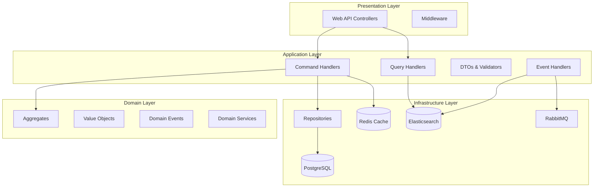
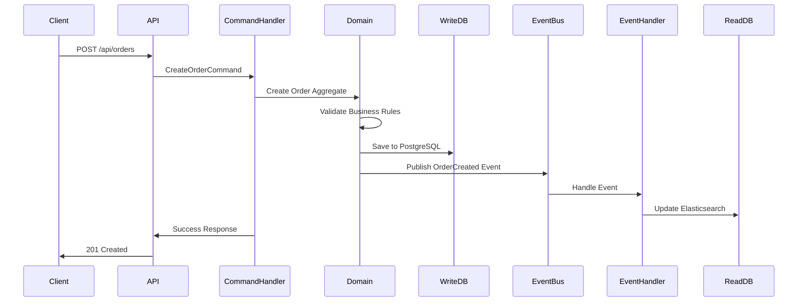

# Design Document

## Overview

This design document outlines the architecture and implementation approach for a .NET 9 e-commerce solution using Domain Driven Design (DDD), Command Query Responsibility Segregation (CQRS), and Clean Architecture patterns. The solution provides a scalable, maintainable platform with clear separation of concerns, leveraging modern .NET 9 features and industry-standard libraries.

The architecture follows the principle of dependency inversion, with the domain layer at the center, surrounded by application services, and infrastructure concerns at the outer layers. CQRS separates read and write operations, enabling independent scaling and optimization of each concern.

## Architecture

### High-Level Architecture



### CQRS Flow



### Project Structure

```
ECommerce.Solution/
├── src/
│   ├── Core/
│   │   ├── ECommerce.Domain/
│   │   │   ├── Aggregates/
│   │   │   │   ├── ProductAggregate/
│   │   │   │   ├── OrderAggregate/
│   │   │   │   └── CustomerAggregate/
│   │   │   ├── ValueObjects/
│   │   │   ├── Events/
│   │   │   ├── Exceptions/
│   │   │   └── Interfaces/
│   │   └── ECommerce.Application/
│   │       ├── Commands/
│   │       ├── Queries/
│   │       ├── Handlers/
│   │       ├── DTOs/
│   │       ├── Validators/
│   │       ├── Mappings/
│   │       └── Interfaces/
│   ├── Infrastructure/
│   │   ├── ECommerce.Infrastructure/
│   │   │   ├── Persistence/
│   │   │   ├── Repositories/
│   │   │   ├── Services/
│   │   │   ├── Messaging/
│   │   │   └── Caching/
│   │   └── ECommerce.ReadModel/
│   │       ├── Models/
│   │       ├── Services/
│   │       └── Configurations/
│   └── Presentation/
│       └── ECommerce.WebAPI/
│           ├── Controllers/
│           ├── Middleware/
│           ├── Extensions/
│           └── Configuration/
├── tests/
│   ├── ECommerce.Domain.Tests/
│   ├── ECommerce.Application.Tests/
│   ├── ECommerce.Infrastructure.Tests/
│   └── ECommerce.WebAPI.Tests/
└── docker-compose.yml
```

## Components and Interfaces

### Domain Layer Components

#### Aggregates

**Product Aggregate**
- **Product (Root)**: Manages product lifecycle, inventory, pricing
- **Category**: Product categorization with hierarchical structure
- **ProductReview**: Customer reviews and ratings
- **Invariants**: Stock cannot be negative, price must be positive, reviews require valid customer

**Order Aggregate**
- **Order (Root)**: Manages order lifecycle and business rules
- **OrderItem**: Individual items within an order with quantity and pricing
- **Payment**: Payment information and status tracking
- **Invariants**: Order total matches sum of items, payment amount matches order total

**Customer Aggregate**
- **Customer (Root)**: Customer identity and profile management
- **Address**: Shipping and billing addresses with validation
- **Profile**: Customer preferences and settings
- **Invariants**: Email uniqueness, valid address formats

#### Value Objects

```csharp
public record Money(decimal Amount, string Currency)
{
    public static Money Zero(string currency) => new(0, currency);
    public Money Add(Money other) => 
        Currency == other.Currency ? 
        new Money(Amount + other.Amount, Currency) : 
        throw new InvalidOperationException("Cannot add different currencies");
}

public record Email(string Value)
{
    public Email
    {
        if (string.IsNullOrWhiteSpace(Value) || !IsValidEmail(Value))
            throw new ArgumentException("Invalid email format");
    }
}

public record PhoneNumber(string Value)
{
    public PhoneNumber
    {
        if (string.IsNullOrWhiteSpace(Value) || !IsValidPhoneNumber(Value))
            throw new ArgumentException("Invalid phone number format");
    }
}
```

#### Domain Events

```csharp
public abstract record DomainEvent(Guid Id, DateTime OccurredOn);

public record ProductCreatedEvent(
    Guid Id, 
    DateTime OccurredOn, 
    Guid ProductId, 
    string Name, 
    Money Price
) : DomainEvent(Id, OccurredOn);

public record OrderPlacedEvent(
    Guid Id, 
    DateTime OccurredOn, 
    Guid OrderId, 
    Guid CustomerId, 
    Money TotalAmount
) : DomainEvent(Id, OccurredOn);
```

### Application Layer Components

#### Command/Query Separation

**Commands** (Write Operations)
```csharp
public record CreateProductCommand(
    string Name,
    string Description,
    decimal Price,
    string Currency,
    int StockQuantity,
    Guid CategoryId
) : IRequest<Guid>;

public record PlaceOrderCommand(
    Guid CustomerId,
    List<OrderItemDto> Items,
    AddressDto ShippingAddress
) : IRequest<Guid>;
```

**Queries** (Read Operations)
```csharp
public record GetProductsQuery(
    int Page,
    int PageSize,
    string? SearchTerm,
    Guid? CategoryId
) : IRequest<PagedResult<ProductDto>>;

public record GetOrderQuery(Guid OrderId) : IRequest<OrderDto>;
```

#### Handlers with MediatR

```csharp
public class CreateProductCommandHandler(
    IProductRepository productRepository,
    IUnitOfWork unitOfWork,
    IMapper mapper
) : IRequestHandler<CreateProductCommand, Guid>
{
    public async Task<Guid> Handle(CreateProductCommand request, CancellationToken cancellationToken)
    {
        var product = Product.Create(
            request.Name,
            request.Description,
            new Money(request.Price, request.Currency),
            request.StockQuantity,
            request.CategoryId
        );
        
        await productRepository.AddAsync(product);
        await unitOfWork.SaveChangesAsync(cancellationToken);
        
        return product.Id;
    }
}
```

### Infrastructure Layer Components

#### Repository Pattern

```csharp
public interface IRepository<T> where T : class
{
    Task<T?> GetByIdAsync(Guid id);
    Task<IEnumerable<T>> GetAllAsync();
    Task AddAsync(T entity);
    void Update(T entity);
    void Delete(T entity);
}

public interface IProductRepository : IRepository<Product>
{
    Task<IEnumerable<Product>> GetByCategoryAsync(Guid categoryId);
    Task<PagedResult<Product>> SearchAsync(string searchTerm, int page, int pageSize);
}
```

#### Unit of Work Pattern

```csharp
public interface IUnitOfWork
{
    Task<int> SaveChangesAsync(CancellationToken cancellationToken = default);
    Task BeginTransactionAsync();
    Task CommitTransactionAsync();
    Task RollbackTransactionAsync();
}
```

#### Event Sourcing and Messaging

```csharp
public interface IEventStore
{
    Task SaveEventsAsync(Guid aggregateId, IEnumerable<DomainEvent> events, int expectedVersion);
    Task<IEnumerable<DomainEvent>> GetEventsAsync(Guid aggregateId);
}

public interface IEventBus
{
    Task PublishAsync<T>(T @event) where T : DomainEvent;
    Task SubscribeAsync<T>(Func<T, Task> handler) where T : DomainEvent;
}
```

## Data Models

### Write Model (PostgreSQL)

```sql
-- Products Table
CREATE TABLE Products (
    Id UUID PRIMARY KEY,
    Name VARCHAR(255) NOT NULL,
    Description TEXT,
    Price DECIMAL(18,2) NOT NULL,
    Currency VARCHAR(3) NOT NULL,
    StockQuantity INTEGER NOT NULL,
    CategoryId UUID NOT NULL,
    CreatedAt TIMESTAMP NOT NULL,
    UpdatedAt TIMESTAMP NOT NULL
);

-- Orders Table
CREATE TABLE Orders (
    Id UUID PRIMARY KEY,
    CustomerId UUID NOT NULL,
    Status VARCHAR(50) NOT NULL,
    TotalAmount DECIMAL(18,2) NOT NULL,
    Currency VARCHAR(3) NOT NULL,
    CreatedAt TIMESTAMP NOT NULL,
    UpdatedAt TIMESTAMP NOT NULL
);

-- Order Items Table
CREATE TABLE OrderItems (
    Id UUID PRIMARY KEY,
    OrderId UUID NOT NULL REFERENCES Orders(Id),
    ProductId UUID NOT NULL,
    Quantity INTEGER NOT NULL,
    UnitPrice DECIMAL(18,2) NOT NULL,
    Currency VARCHAR(3) NOT NULL
);
```

### Read Model (Elasticsearch)

```json
{
  "mappings": {
    "properties": {
      "id": { "type": "keyword" },
      "name": { "type": "text", "analyzer": "standard" },
      "description": { "type": "text" },
      "price": { "type": "double" },
      "currency": { "type": "keyword" },
      "category": {
        "properties": {
          "id": { "type": "keyword" },
          "name": { "type": "text" }
        }
      },
      "stockQuantity": { "type": "integer" },
      "averageRating": { "type": "double" },
      "reviewCount": { "type": "integer" },
      "createdAt": { "type": "date" },
      "updatedAt": { "type": "date" }
    }
  }
}
```

### Caching Strategy (Redis)

```csharp
public class CacheService(IDistributedCache cache, ILogger<CacheService> logger)
{
    public async Task<T?> GetAsync<T>(string key) where T : class
    {
        var cached = await cache.GetStringAsync(key);
        return cached == null ? null : JsonSerializer.Deserialize<T>(cached);
    }
    
    public async Task SetAsync<T>(string key, T value, TimeSpan expiration)
    {
        var options = new DistributedCacheEntryOptions
        {
            AbsoluteExpirationRelativeToNow = expiration
        };
        
        await cache.SetStringAsync(key, JsonSerializer.Serialize(value), options);
    }
}
```

## Error Handling

### Domain Exceptions

```csharp
public abstract class DomainException(string message) : Exception(message);

public class InsufficientStockException(int requested, int available) 
    : DomainException($"Insufficient stock. Requested: {requested}, Available: {available}");

public class InvalidOrderStateException(string currentState, string attemptedAction)
    : DomainException($"Cannot {attemptedAction} order in {currentState} state");
```

### Global Exception Middleware

```csharp
public class ExceptionHandlingMiddleware(RequestDelegate next, ILogger<ExceptionHandlingMiddleware> logger)
{
    public async Task InvokeAsync(HttpContext context)
    {
        try
        {
            await next(context);
        }
        catch (Exception ex)
        {
            logger.LogError(ex, "An unhandled exception occurred");
            await HandleExceptionAsync(context, ex);
        }
    }
    
    private static async Task HandleExceptionAsync(HttpContext context, Exception exception)
    {
        var response = exception switch
        {
            DomainException => new { error = exception.Message, statusCode = 400 },
            ValidationException => new { error = "Validation failed", statusCode = 400 },
            NotFoundException => new { error = "Resource not found", statusCode = 404 },
            _ => new { error = "Internal server error", statusCode = 500 }
        };
        
        context.Response.StatusCode = response.statusCode;
        await context.Response.WriteAsync(JsonSerializer.Serialize(response));
    }
}
```

## Testing Strategy

### Unit Testing Approach

**Domain Tests**
- Test aggregate business rules and invariants
- Test value object validation and behavior
- Test domain event generation
- Use AAA pattern (Arrange, Act, Assert)

**Application Tests**
- Test command and query handlers
- Mock repository and external dependencies
- Test validation pipeline
- Test mapping configurations

**Integration Tests**
- Test API endpoints end-to-end
- Test database operations with test containers
- Test event publishing and handling
- Test caching behavior

### Test Structure

```csharp
public class ProductAggregateTests
{
    [Fact]
    public void Create_Product_Should_Generate_ProductCreated_Event()
    {
        // Arrange
        var name = "Test Product";
        var price = new Money(100, "USD");
        
        // Act
        var product = Product.Create(name, "Description", price, 10, Guid.NewGuid());
        
        // Assert
        product.DomainEvents.Should().ContainSingle()
            .Which.Should().BeOfType<ProductCreatedEvent>();
    }
}
```

### Performance Considerations

**Database Optimization**
- Use appropriate indexes for query patterns
- Implement connection pooling
- Use read replicas for query operations
- Implement database sharding for horizontal scaling

**Caching Strategy**
- Cache frequently accessed read models
- Implement cache-aside pattern
- Use Redis clustering for high availability
- Implement cache invalidation strategies

**Elasticsearch Optimization**
- Use appropriate mapping configurations
- Implement bulk indexing for better performance
- Use search templates for complex queries
- Implement index lifecycle management

**Message Queue Optimization**
- Use message batching where appropriate
- Implement dead letter queues for error handling
- Use message acknowledgments for reliability
- Implement circuit breaker pattern for resilience