# ECommerce Solution Architecture

## Overview

This document provides a comprehensive overview of the ECommerce solution architecture, built using Domain Driven Design (DDD), Command Query Responsibility Segregation (CQRS), and Clean Architecture patterns with .NET 9.

## Table of Contents

- [Architectural Principles](#architectural-principles)
- [High-Level Architecture](#high-level-architecture)
- [Layer Architecture](#layer-architecture)
- [CQRS Implementation](#cqrs-implementation)
- [Domain Design](#domain-design)
- [Data Architecture](#data-architecture)
- [Event-Driven Architecture](#event-driven-architecture)
- [Infrastructure Components](#infrastructure-components)
- [Security Architecture](#security-architecture)
- [Scalability Considerations](#scalability-considerations)
- [Deployment Architecture](#deployment-architecture)

## Architectural Principles

### Core Principles

1. **Separation of Concerns**: Clear boundaries between business logic, application services, and infrastructure
2. **Dependency Inversion**: Dependencies point inward toward the domain layer
3. **Single Responsibility**: Each component has a single, well-defined purpose
4. **Open/Closed Principle**: Open for extension, closed for modification
5. **Interface Segregation**: Clients depend only on interfaces they use
6. **Don't Repeat Yourself (DRY)**: Avoid code duplication through proper abstraction

### Design Patterns

- **Domain Driven Design (DDD)**: Business logic encapsulated in domain aggregates
- **CQRS**: Separate read and write operations for optimal performance
- **Event Sourcing**: Domain events for system integration and audit trails
- **Repository Pattern**: Abstraction over data access
- **Unit of Work**: Transactional consistency across aggregates
- **Mediator Pattern**: Decoupled request/response handling

## High-Level Architecture

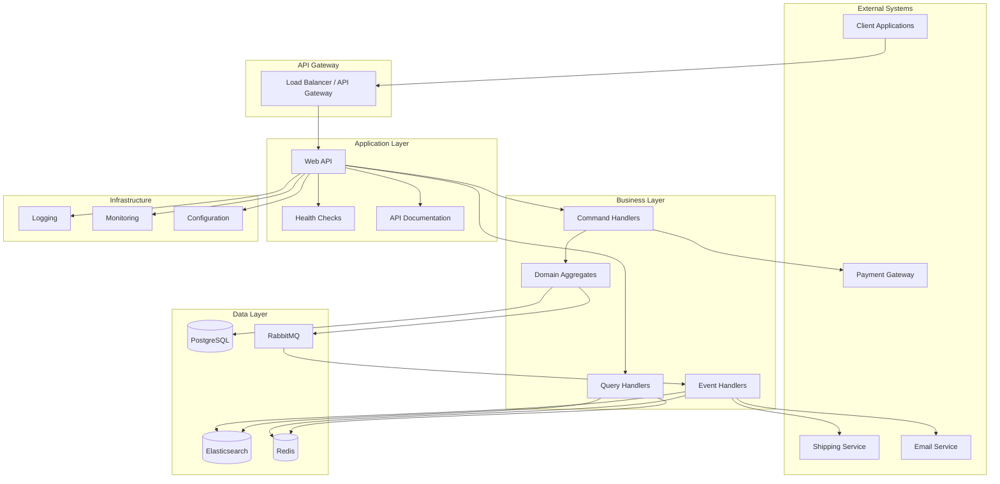

## Layer Architecture

### Clean Architecture Layers

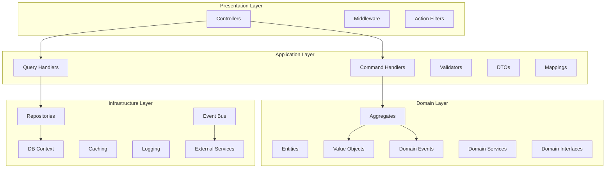

### Layer Responsibilities

#### Presentation Layer
- **Controllers**: HTTP request/response handling
- **Middleware**: Cross-cutting concerns (authentication, logging, error handling)
- **Filters**: Request/response processing pipeline
- **DTOs**: Data transfer between layers

#### Application Layer
- **Command Handlers**: Process write operations
- **Query Handlers**: Process read operations
- **Validators**: Input validation using FluentValidation
- **Mappings**: Object-to-object mapping with AutoMapper
- **Application Services**: Orchestrate domain operations

#### Domain Layer
- **Aggregates**: Business logic encapsulation with invariants
- **Entities**: Domain objects with identity
- **Value Objects**: Immutable objects without identity
- **Domain Events**: Business events for integration
- **Domain Services**: Business logic that doesn't belong to entities

#### Infrastructure Layer
- **Repositories**: Data access abstraction
- **DB Context**: Entity Framework Core configuration
- **Event Bus**: Message publishing and handling
- **Caching**: Redis-based caching implementation
- **External Services**: Third-party integrations

## CQRS Implementation

### Command Query Separation

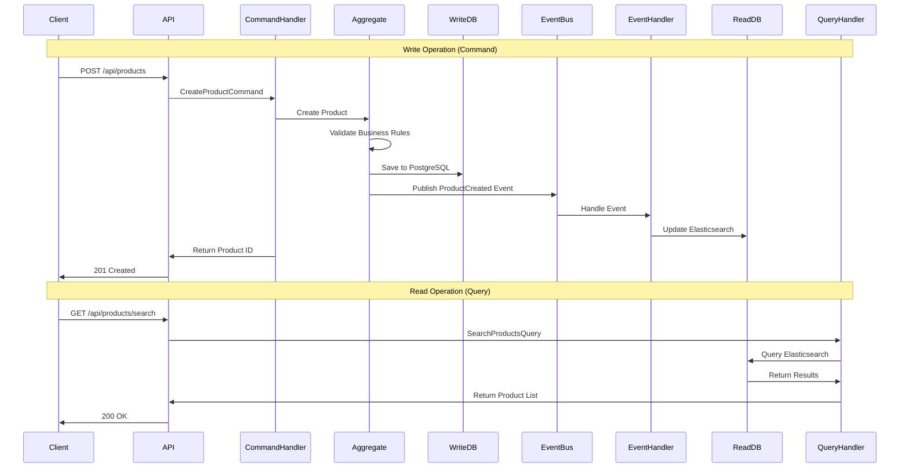

### Command Side (Write)

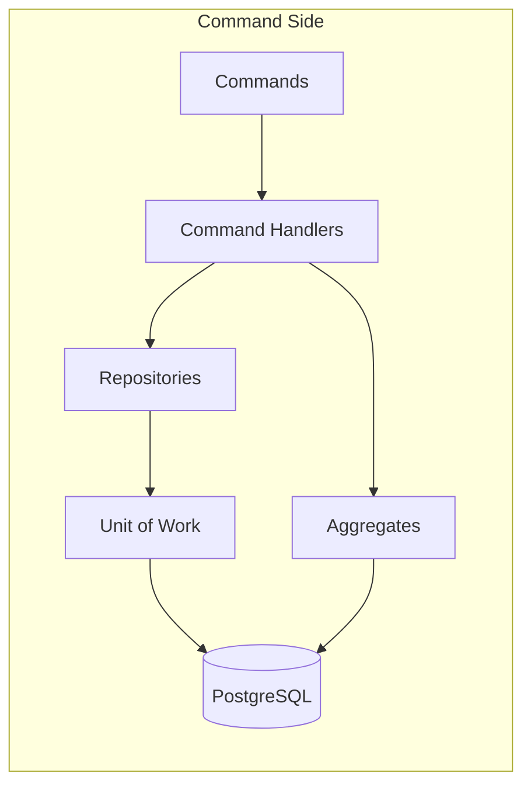

### Query Side (Read)

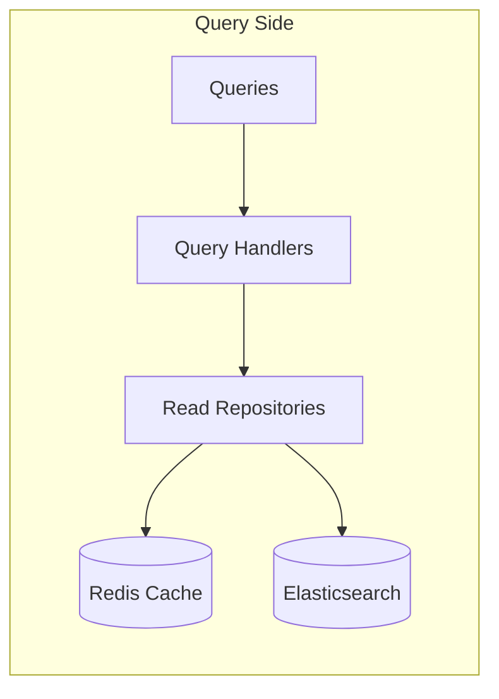

## Domain Design

### Aggregate Design

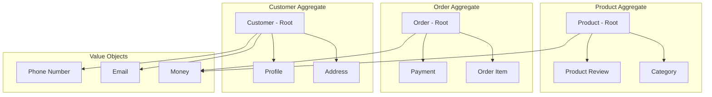

### Domain Events Flow

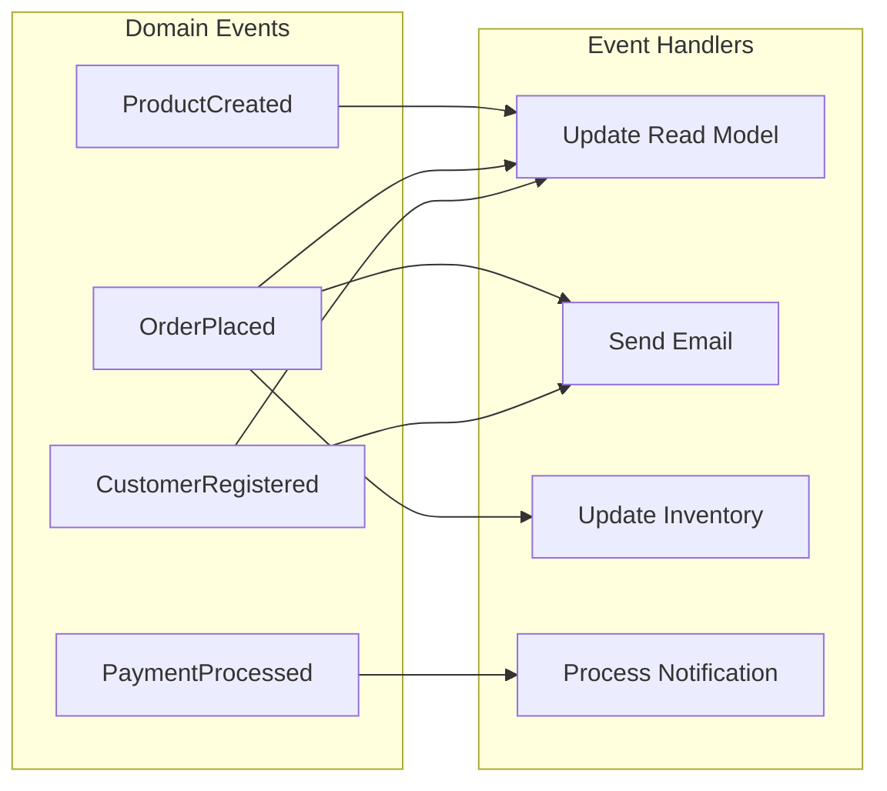

### Aggregate Boundaries and Invariants

#### Product Aggregate
- **Invariants**:
  - Stock quantity cannot be negative
  - Price must be positive
  - Product must belong to a valid category
  - Reviews require valid customer and rating (1-5)

#### Order Aggregate
- **Invariants**:
  - Order total must match sum of order items
  - Payment amount must match order total
  - Order items must reference valid products
  - Order status transitions must follow business rules

#### Customer Aggregate
- **Invariants**:
  - Email must be unique across all customers
  - Phone number must be valid format
  - At least one address is required
  - Profile information must be consistent

## Data Architecture

### Write Model (PostgreSQL)

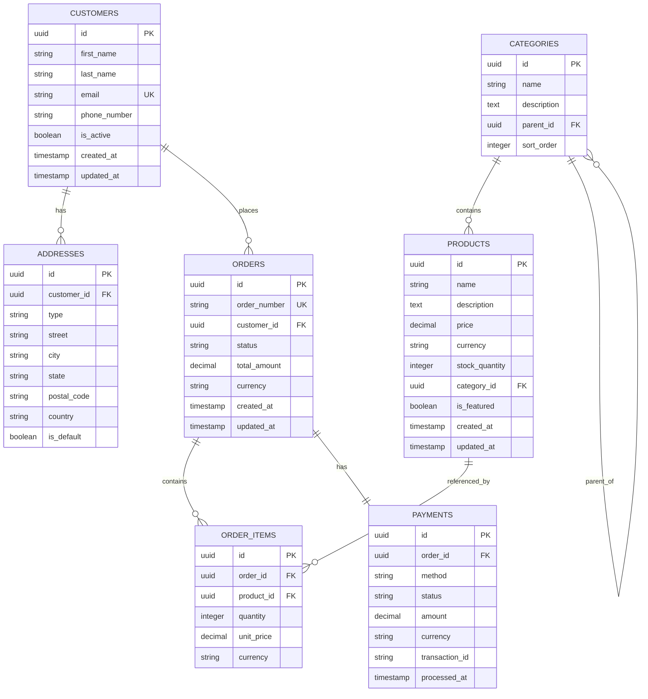

### Read Model (Elasticsearch)

```json
{
  "products": {
    "mappings": {
      "properties": {
        "id": { "type": "keyword" },
        "name": { 
          "type": "text", 
          "analyzer": "standard",
          "fields": {
            "keyword": { "type": "keyword" }
          }
        },
        "description": { "type": "text" },
        "price": { "type": "double" },
        "currency": { "type": "keyword" },
        "category": {
          "properties": {
            "id": { "type": "keyword" },
            "name": { "type": "text" },
            "path": { "type": "keyword" }
          }
        },
        "stockQuantity": { "type": "integer" },
        "averageRating": { "type": "double" },
        "reviewCount": { "type": "integer" },
        "tags": { "type": "keyword" },
        "isFeatured": { "type": "boolean" },
        "createdAt": { "type": "date" },
        "updatedAt": { "type": "date" }
      }
    }
  }
}
```

### Caching Strategy

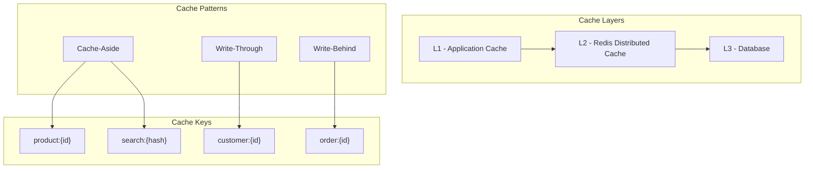

## Event-Driven Architecture

### Event Flow

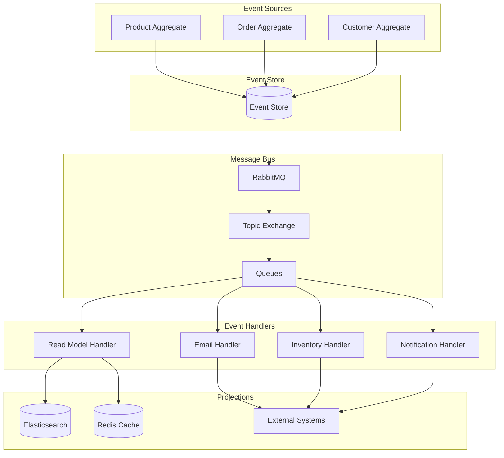

### Event Processing Patterns

#### At-Least-Once Delivery
- Events are guaranteed to be delivered at least once
- Handlers must be idempotent
- Duplicate detection and handling

#### Event Ordering
- Events within an aggregate are ordered
- Cross-aggregate events may be processed out of order
- Eventual consistency across aggregates

#### Error Handling
- Dead letter queues for failed events
- Retry policies with exponential backoff
- Circuit breaker pattern for external services

## Infrastructure Components

### Service Dependencies

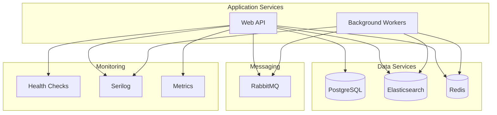

### Health Check Architecture

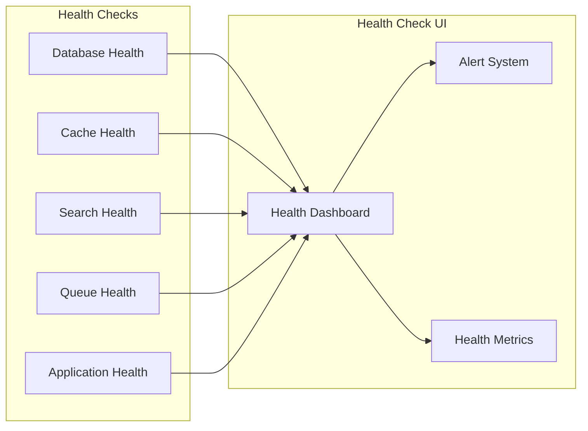

## Security Architecture

### Security Layers

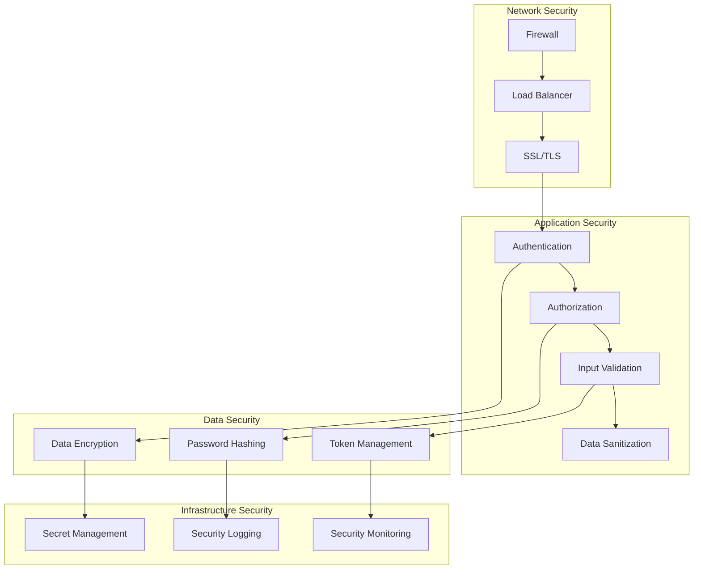

### Security Considerations

#### Authentication & Authorization
- JWT Bearer tokens for API access
- Role-based access control (RBAC)
- OAuth 2.0 / OpenID Connect integration
- API key management for service-to-service communication

#### Data Protection
- Encryption at rest for sensitive data
- Encryption in transit (HTTPS/TLS)
- Personal data anonymization
- GDPR compliance considerations

#### Input Validation
- Server-side validation for all inputs
- SQL injection prevention
- XSS protection
- CSRF protection

## Scalability Considerations

### Horizontal Scaling

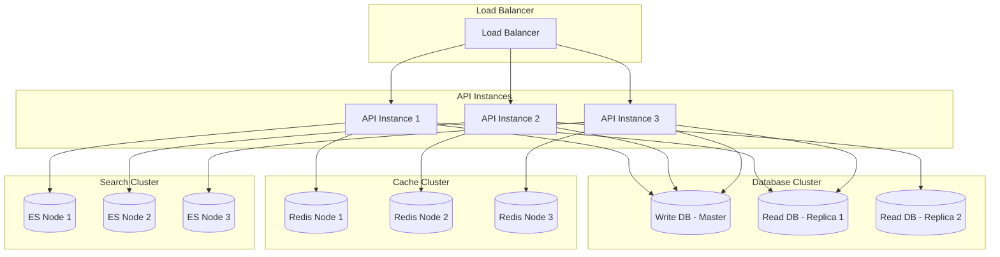

### Performance Optimization

#### Database Optimization
- Read replicas for query scaling
- Connection pooling
- Query optimization and indexing
- Database sharding for large datasets

#### Caching Strategy
- Multi-level caching (L1, L2, L3)
- Cache warming strategies
- Cache invalidation patterns
- Distributed caching with Redis

#### Search Optimization
- Elasticsearch cluster configuration
- Index optimization and sharding
- Search result caching
- Faceted search performance

## Deployment Architecture

### Container Architecture

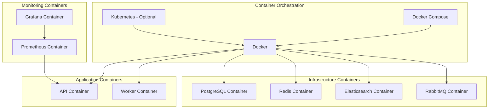

### Environment Configuration

#### Development Environment
- Local development with Docker Compose
- Hot reload for rapid development
- Debug logging and detailed error messages
- Swagger UI for API testing

#### Staging Environment
- Production-like configuration
- Integration testing environment
- Performance testing setup
- Security testing validation

#### Production Environment
- High availability configuration
- Load balancing and auto-scaling
- Monitoring and alerting
- Backup and disaster recovery

### Deployment Strategies

#### Blue-Green Deployment
- Zero-downtime deployments
- Quick rollback capability
- Full environment validation
- Traffic switching strategies

#### Rolling Deployment
- Gradual instance replacement
- Continuous availability
- Resource-efficient updates
- Automated health checks

#### Canary Deployment
- Risk mitigation for new releases
- Gradual traffic shifting
- A/B testing capabilities
- Automated rollback triggers

## Monitoring and Observability

### Observability Stack

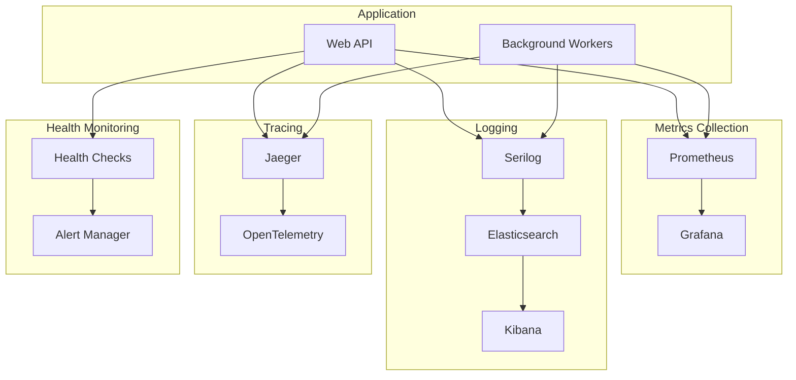

### Key Metrics

#### Application Metrics
- Request throughput (requests/second)
- Response time percentiles (P50, P95, P99)
- Error rates by endpoint
- Active user sessions

#### Infrastructure Metrics
- CPU and memory utilization
- Database connection pool usage
- Cache hit/miss ratios
- Queue depth and processing rates

#### Business Metrics
- Order conversion rates
- Revenue per customer
- Product search effectiveness
- Customer satisfaction scores

This architecture provides a solid foundation for a scalable, maintainable, and robust e-commerce solution that can grow with business needs while maintaining high performance and reliability.