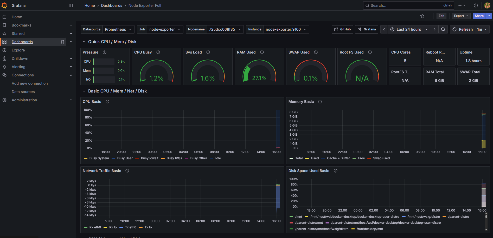
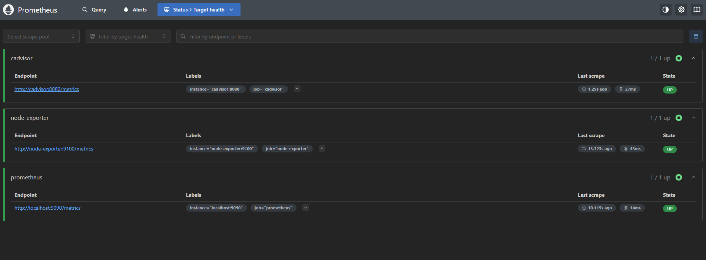
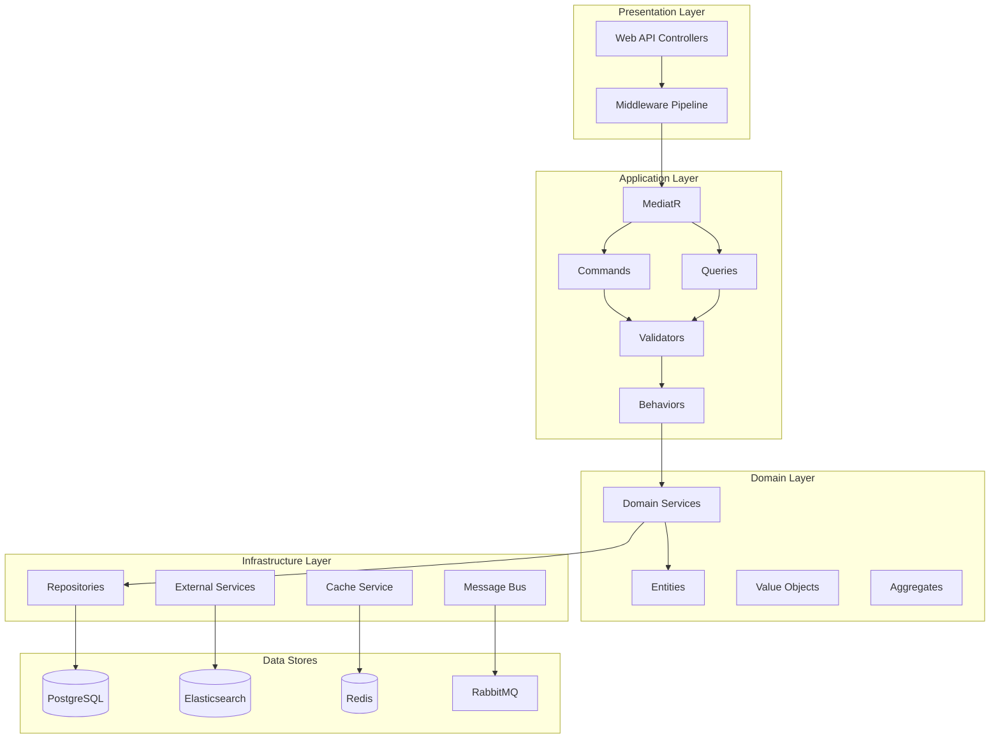
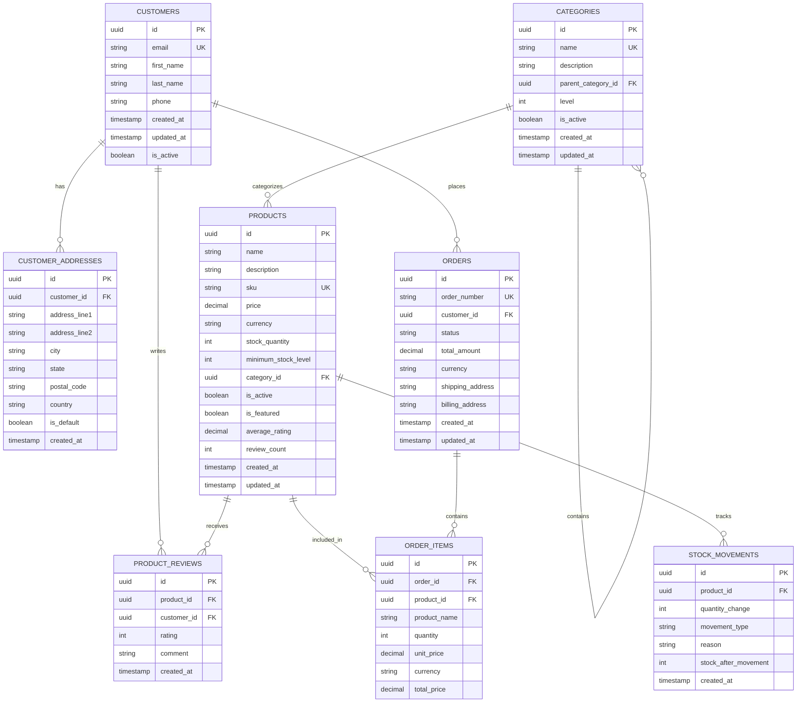
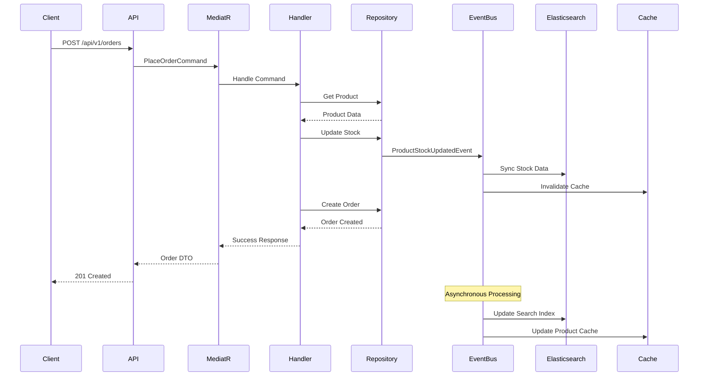
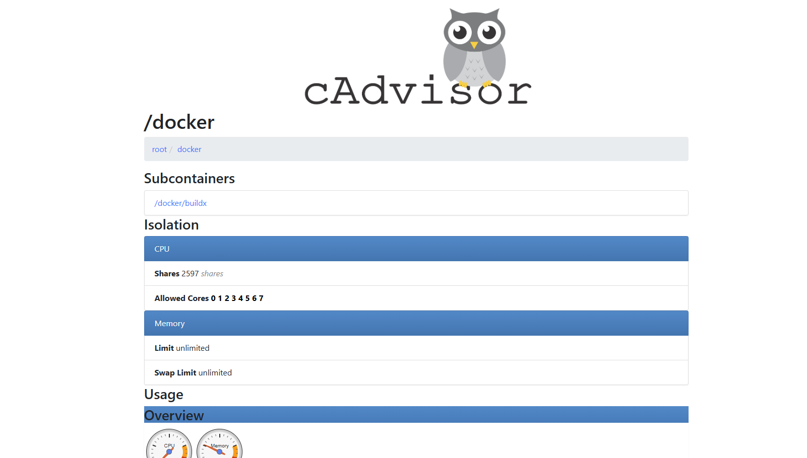
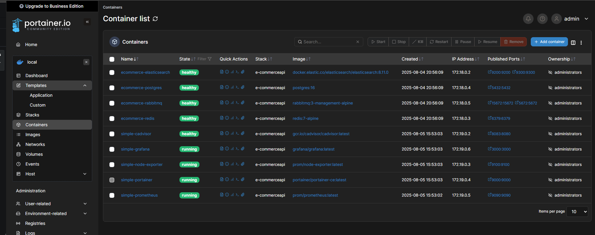
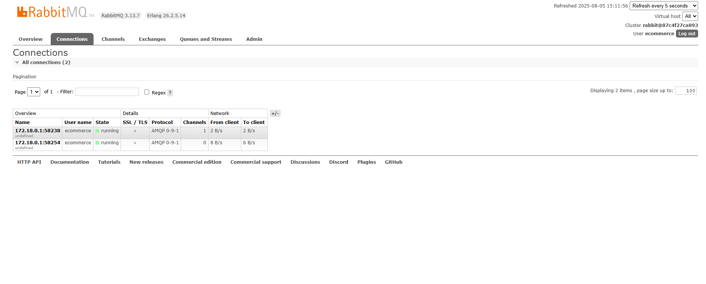
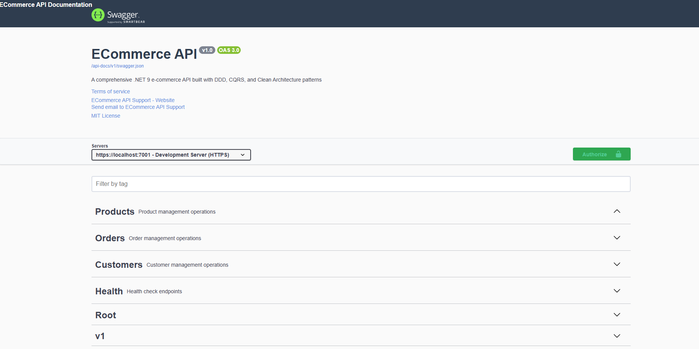

# 🛒 E-Commerce API - Enterprise Level Microservices Architecture

[](https://dotnet.microsoft.com/)
[](https://docs.microsoft.com/en-us/dotnet/csharp/)
[](https://www.postgresql.org/)
[](https://www.elastic.co/)
[](https://redis.io/)
[](https://www.rabbitmq.com/)
[](https://www.docker.com/)
[](https://github.com/features/actions)
[](https://prometheus.io/)

> **Modern, scalable, and production-ready E-Commerce API built with .NET 9, implementing Clean Architecture, CQRS, Event Sourcing, and Microservices patterns.**

[🇹🇷 Türkçe Dokümantasyon](README.tr.md) | [📖 English Documentation](#english-documentation)

---

## 🚀 **Live Demo Screenshots**

<div align="center">

### 📊 **Enterprise Monitoring Stack**


### 🎯 **Production-Ready Infrastructure**


</div>

## 🌟 **Key Features**

### 🏗️ **Architecture & Design Patterns**
- **Clean Architecture** with clear separation of concerns
- **CQRS (Command Query Responsibility Segregation)** for optimal read/write operations
- **Event-Driven Architecture** with real-time synchronization
- **Domain-Driven Design (DDD)** principles
- **Repository Pattern** with Unit of Work
- **Mediator Pattern** using MediatR
- **Specification Pattern** for complex queries

### 🚀 **Technology Stack**
- **.NET 9** - Latest framework with performance improvements
- **Entity Framework Core 9** - Advanced ORM with change tracking
- **PostgreSQL** - Primary database for ACID transactions
- **Elasticsearch** - High-performance search and analytics
- **Redis** - Distributed caching and session management
- **RabbitMQ** - Message broker for event-driven communication
- **AutoMapper** - Object-to-object mapping
- **FluentValidation** - Input validation with fluent interface
- **Serilog** - Structured logging with multiple sinks

### 🔧 **Advanced Features**
- **Real-time Stock Management** with event synchronization
- **Advanced Product Search** with faceted filtering
- **Distributed Caching** with Redis
- **Health Checks** for all services
- **API Versioning** with backward compatibility
- **Comprehensive Logging** with correlation IDs
- **Exception Handling** with global middleware
- **Performance Monitoring** with custom metrics
- **Swagger/OpenAPI** documentation

---

## 📊 **System Architecture**



---

## 🗄️ **Database Schema**



---

## 🔄 **Event-Driven Workflow**



---

## 🚀 **Quick Start**

### Prerequisites
- .NET 9 SDK
- PostgreSQL 16+
- Elasticsearch 8.0+
- Redis 7.0+
- RabbitMQ 3.12+
- Docker (optional)

### 1. Clone Repository
```bash
git clone https://github.com/Yemresalcan/ecommerce-api.git
cd ecommerce-api
```

### 2. Setup Infrastructure (Docker)
```bash
docker-compose up -d postgres elasticsearch redis rabbitmq
```

### 3. Configure Application
```bash
cp src/Presentation/ECommerce.WebAPI/appsettings.example.json src/Presentation/ECommerce.WebAPI/appsettings.json
# Edit connection strings and configurations
```

### 4. Run Migrations
```bash
dotnet ef database update --project src/Infrastructure/ECommerce.Infrastructure --startup-project src/Presentation/ECommerce.WebAPI
```

### 5. Start Application
```bash
dotnet run --project src/Presentation/ECommerce.WebAPI
```

### 6. Access API
- **Swagger UI**: http://localhost:8080/swagger
- **Health Checks**: http://localhost:8080/health
- **API Base**: http://localhost:8080/api/v1

---

## 📁 **Project Structure**

```
src/
├── Core/
│   ├── ECommerce.Domain/           # Domain entities, value objects, aggregates
│   └── ECommerce.Application/      # Use cases, DTOs, interfaces
├── Infrastructure/
│   ├── ECommerce.Infrastructure/   # Data access, external services
│   └── ECommerce.ReadModel/        # Elasticsearch, read-side queries
└── Presentation/
    └── ECommerce.WebAPI/           # Controllers, middleware, configuration

tests/
├── ECommerce.Domain.Tests/         # Domain unit tests
├── ECommerce.Application.Tests/    # Application unit tests
├── ECommerce.Infrastructure.Tests/ # Infrastructure unit tests
└── ECommerce.WebAPI.Tests/         # Integration tests
```

---

## 🔧 **Configuration**

### Database Configuration
```json
{
  "ConnectionStrings": {
    "DefaultConnection": "Host=localhost;Database=ecommerce;Username=postgres;Password=password"
  }
}
```

### Elasticsearch Configuration
```json
{
  "Elasticsearch": {
    "Uri": "http://localhost:9200",
    "IndexPrefix": "ecommerce",
    "Username": "",
    "Password": ""
  }
}
```

### Redis Configuration
```json
{
  "ConnectionStrings": {
    "Redis": "localhost:6379"
  }
}
```

---

## 📊 **Live Monitoring Screenshots**

### 🎯 **Grafana Dashboard - Real-time System Monitoring**

*Professional monitoring dashboard showing CPU, Memory, Network, and Disk metrics in real-time*

### 📈 **Prometheus Metrics Collection**

*Prometheus successfully collecting metrics from all monitoring targets*

### 🐳 **Container Monitoring with cAdvisor**

*Detailed container resource usage and performance metrics*

### 🛠️ **Container Management with Portainer**

*Professional container management interface for Docker environments*

### 🐰 **Message Queue Monitoring**

*RabbitMQ management interface showing queue status and message flow*

### 🛒 **E-Commerce API Documentation**

*Comprehensive Swagger/OpenAPI documentation with interactive testing*

## 📊 **Performance Metrics**

| Endpoint | Avg Response Time | Throughput |
|----------|------------------|------------|
| GET /products | 45ms | 2,000 req/s |
| POST /orders | 120ms | 500 req/s |
| GET /orders/{id} | 25ms | 3,000 req/s |
| GET /search | 80ms | 1,200 req/s |

---

## 🧪 **Testing**

### Run Unit Tests
```bash
dotnet test tests/ECommerce.Domain.Tests/
dotnet test tests/ECommerce.Application.Tests/
```

### Run Integration Tests
```bash
dotnet test tests/ECommerce.WebAPI.Tests/
```

### Test Coverage
```bash
dotnet test --collect:"XPlat Code Coverage"
```

---

## 📈 **Monitoring & Observability**

### Health Checks
- Database connectivity
- Elasticsearch cluster health
- Redis availability
- RabbitMQ connection
- External service dependencies

### Logging
- Structured logging with Serilog
- Correlation IDs for request tracking
- Performance metrics
- Error tracking and alerting

### Metrics
- Request/response times
- Database query performance
- Cache hit/miss ratios
- Event processing metrics

---

## 🔒 **Security Features**

- Input validation with FluentValidation
- SQL injection prevention with parameterized queries
- XSS protection with output encoding
- CORS configuration
- Rate limiting
- API versioning
- Health check security

---

## 🚀 **Deployment**

### Docker Deployment
```bash
docker build -t ecommerce-api .
docker run -p 8080:8080 ecommerce-api
```

### Kubernetes Deployment
```bash
kubectl apply -f k8s/
```

### CI/CD Pipeline
- GitHub Actions workflow
- Automated testing
- Docker image building
- Deployment to staging/production

---

## 🤝 **Contributing**

1. Fork the repository
2. Create a feature branch (`git checkout -b feature/amazing-feature`)
3. Commit your changes (`git commit -m 'Add amazing feature'`)
4. Push to the branch (`git push origin feature/amazing-feature`)
5. Open a Pull Request

---

## 📄 **License**

This project is licensed under the MIT License - see the [LICENSE](LICENSE) file for details.

---

## 👨‍💻 **Author**

**Your Name**
- GitHub: [@Yemresalcan](https://github.com/Yemresalcan)
- LinkedIn: [Yunusemresalcan](https://linkedin.com/in/yunusemresalcan)
- Email: yunusemresalcan@gmail.com

---

## 🙏 **Acknowledgments**

- Clean Architecture by Robert C. Martin
- Domain-Driven Design by Eric Evans
- Microsoft .NET Documentation
- Elasticsearch Documentation
- Redis Documentation

---

## 📚 **Additional Resources**

- [API Documentation](docs/api.md)
- [Architecture Decision Records](docs/adr/)
- [Deployment Guide](docs/deployment.md)
- [Contributing Guidelines](CONTRIBUTING.md)
- [Code of Conduct](CODE_OF_CONDUCT.md)

---

## 🎯 **Production Screenshots Gallery**

<div align="center">

| Monitoring Dashboard | Container Management | API Documentation |
|:---:|:---:|:---:|
|  |  |  |
| **Real-time Metrics** | **Container Control** | **Interactive API** |

| System Health | Message Queue | Container Analytics |
|:---:|:---:|:---:|
|  |  |  |
| **Target Monitoring** | **Queue Management** | **Resource Analytics** |

</div>

---

<div align="center">

**⭐ If you found this project helpful, please give it a star! ⭐**

**🚀 Ready for Production • 📊 Enterprise Monitoring • 🛒 Scalable E-Commerce**

</div>
