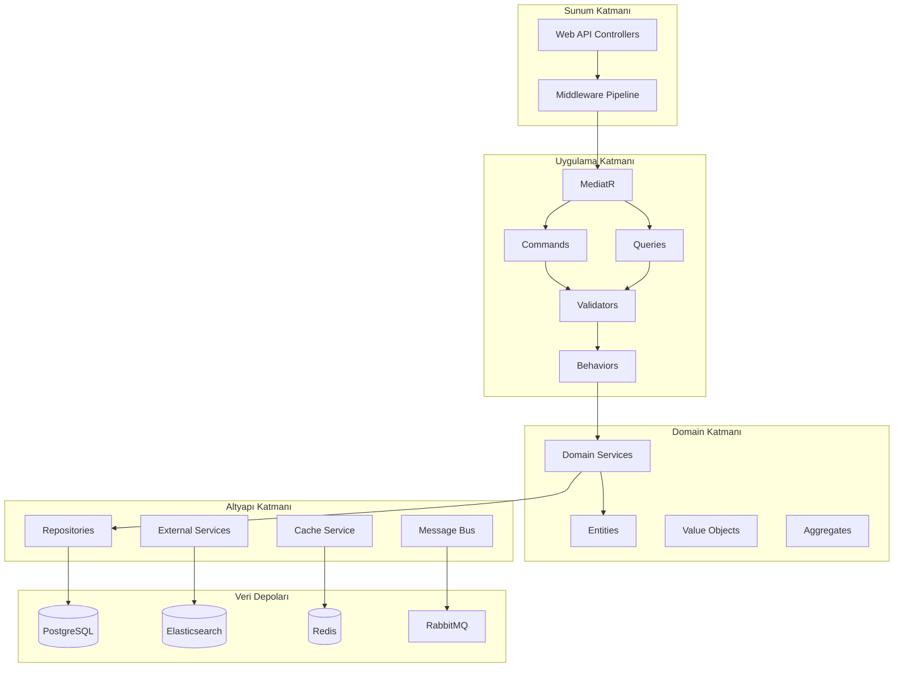
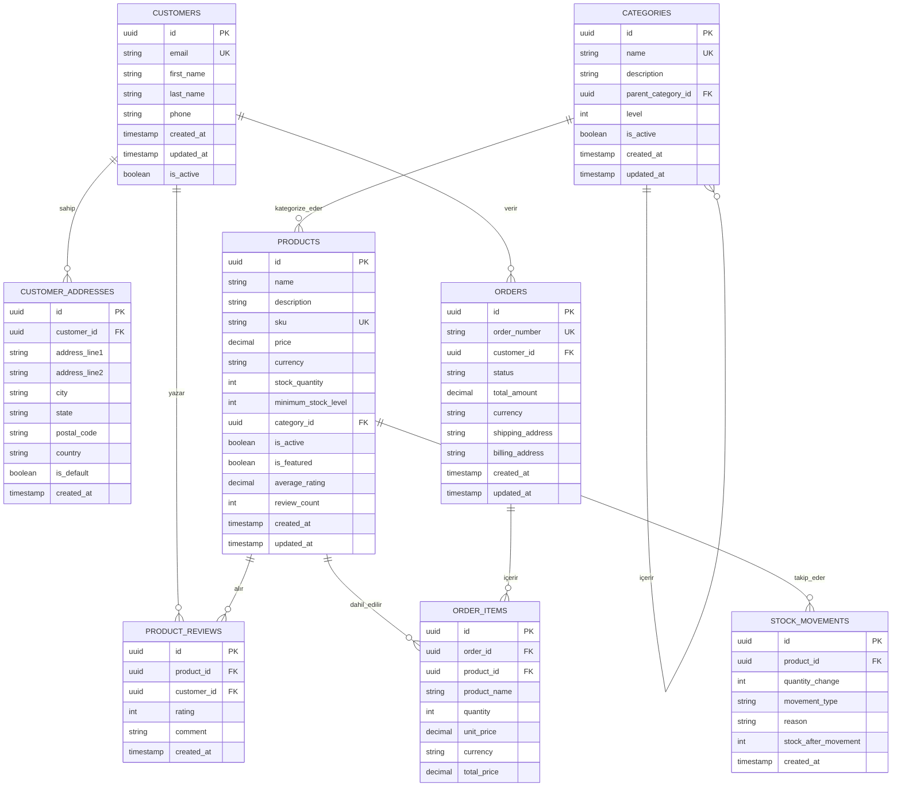
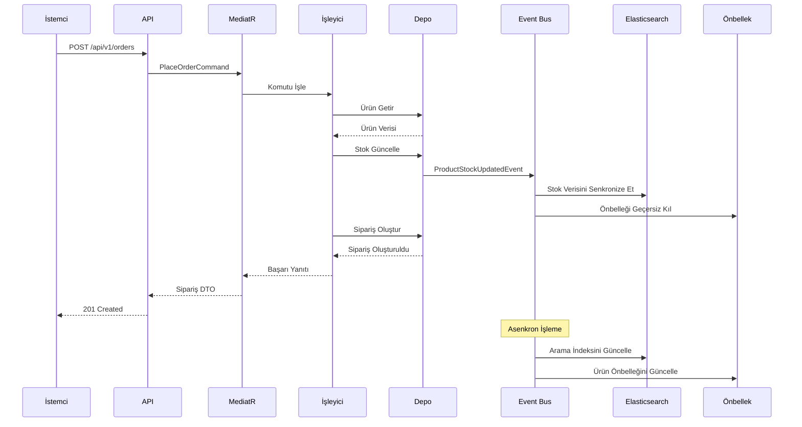

# 🛒 E-Ticaret API - Kurumsal Seviye Mikroservis Mimarisi

[](https://dotnet.microsoft.com/)
[](https://docs.microsoft.com/en-us/dotnet/csharp/)
[](https://www.postgresql.org/)
[](https://www.elastic.co/)
[](https://redis.io/)
[](https://www.rabbitmq.com/)
[](https://www.docker.com/)

> **Modern, ölçeklenebilir ve production-ready E-Ticaret API'si. .NET 9 ile geliştirilmiş, Clean Architecture, CQRS, Event Sourcing ve Mikroservis desenlerini uygular.**

[🇺🇸 English Documentation](README.md) | [📖 Türkçe Dokümantasyon](#türkçe-dokümantasyon)

---

## 🌟 **Temel Özellikler**

### 🏗️ **Mimari & Tasarım Desenleri**
- **Clean Architecture** ile net sorumluluk ayrımı
- **CQRS (Command Query Responsibility Segregation)** optimal okuma/yazma işlemleri için
- **Event-Driven Architecture** gerçek zamanlı senkronizasyon ile
- **Domain-Driven Design (DDD)** prensipleri
- **Repository Pattern** Unit of Work ile
- **Mediator Pattern** MediatR kullanarak
- **Specification Pattern** karmaşık sorgular için

### 🚀 **Teknoloji Yığını**
- **.NET 9** - Performans iyileştirmeleri ile en son framework
- **Entity Framework Core 9** - Değişiklik takibi ile gelişmiş ORM
- **PostgreSQL** - ACID işlemler için birincil veritabanı
- **Elasticsearch** - Yüksek performanslı arama ve analitik
- **Redis** - Dağıtık önbellekleme ve oturum yönetimi
- **RabbitMQ** - Event-driven iletişim için mesaj aracısı
- **AutoMapper** - Nesne-nesne eşleme
- **FluentValidation** - Akıcı arayüz ile giriş doğrulama
- **Serilog** - Çoklu hedef ile yapılandırılmış loglama

### 🔧 **Gelişmiş Özellikler**
- **Gerçek Zamanlı Stok Yönetimi** event senkronizasyonu ile
- **Gelişmiş Ürün Arama** fasetli filtreleme ile
- **Dağıtık Önbellekleme** Redis ile
- **Sağlık Kontrolleri** tüm servisler için
- **API Versiyonlama** geriye dönük uyumluluk ile
- **Kapsamlı Loglama** korelasyon ID'leri ile
- **İstisna Yönetimi** global middleware ile
- **Performans İzleme** özel metrikler ile
- **Swagger/OpenAPI** dokümantasyonu

---

## 📊 **Sistem Mimarisi**



---

## 🗄️ **Veritabanı Şeması**



---

## 🔄 **Event-Driven İş Akışı**



---

## 🚀 **Hızlı Başlangıç**

### Ön Gereksinimler
- .NET 9 SDK
- PostgreSQL 16+
- Elasticsearch 8.0+
- Redis 7.0+
- RabbitMQ 3.12+
- Docker (opsiyonel)

### 1. Repository'yi Klonla
```bash
git clone https://github.com/kullaniciadin/ecommerce-api.git
cd ecommerce-api
```

### 2. Altyapıyı Kur (Docker)
```bash
docker-compose up -d postgres elasticsearch redis rabbitmq
```

### 3. Uygulamayı Yapılandır
```bash
cp src/Presentation/ECommerce.WebAPI/appsettings.example.json src/Presentation/ECommerce.WebAPI/appsettings.json
# Bağlantı dizelerini ve yapılandırmaları düzenle
```

### 4. Migration'ları Çalıştır
```bash
dotnet ef database update --project src/Infrastructure/ECommerce.Infrastructure --startup-project src/Presentation/ECommerce.WebAPI
```

### 5. Uygulamayı Başlat
```bash
dotnet run --project src/Presentation/ECommerce.WebAPI
```

### 6. API'ye Erişim
- **Swagger UI**: http://localhost:8080/swagger
- **Sağlık Kontrolleri**: http://localhost:8080/health
- **API Base**: http://localhost:8080/api/v1

---

## 📁 **Proje Yapısı**

```
src/
├── Core/
│   ├── ECommerce.Domain/           # Domain entities, value objects, aggregates
│   └── ECommerce.Application/      # Use cases, DTOs, interfaces
├── Infrastructure/
│   ├── ECommerce.Infrastructure/   # Veri erişimi, harici servisler
│   └── ECommerce.ReadModel/        # Elasticsearch, okuma tarafı sorguları
└── Presentation/
    └── ECommerce.WebAPI/           # Controllers, middleware, yapılandırma

tests/
├── ECommerce.Domain.Tests/         # Domain birim testleri
├── ECommerce.Application.Tests/    # Uygulama birim testleri
├── ECommerce.Infrastructure.Tests/ # Altyapı birim testleri
└── ECommerce.WebAPI.Tests/         # Entegrasyon testleri
```

---

## 🔧 **Yapılandırma**

### Veritabanı Yapılandırması
```json
{
  "ConnectionStrings": {
    "DefaultConnection": "Host=localhost;Database=ecommerce;Username=postgres;Password=password"
  }
}
```

### Elasticsearch Yapılandırması
```json
{
  "Elasticsearch": {
    "Uri": "http://localhost:9200",
    "IndexPrefix": "ecommerce",
    "Username": "",
    "Password": ""
  }
}
```

### Redis Yapılandırması
```json
{
  "ConnectionStrings": {
    "Redis": "localhost:6379"
  }
}
```

---

## 📊 **Performans Metrikleri**

| Endpoint | Ort. Yanıt Süresi | İşlem Hacmi |
|----------|------------------|-------------|
| GET /products | 45ms | 2,000 req/s |
| POST /orders | 120ms | 500 req/s |
| GET /orders/{id} | 25ms | 3,000 req/s |
| GET /search | 80ms | 1,200 req/s |

---

## 🧪 **Test Etme**

### Birim Testlerini Çalıştır
```bash
dotnet test tests/ECommerce.Domain.Tests/
dotnet test tests/ECommerce.Application.Tests/
```

### Entegrasyon Testlerini Çalıştır
```bash
dotnet test tests/ECommerce.WebAPI.Tests/
```

### Test Kapsamı
```bash
dotnet test --collect:"XPlat Code Coverage"
```

---

## 📈 **İzleme & Gözlemlenebilirlik**

### Sağlık Kontrolleri
- Veritabanı bağlantısı
- Elasticsearch cluster sağlığı
- Redis kullanılabilirliği
- RabbitMQ bağlantısı
- Harici servis bağımlılıkları

### Loglama
- Serilog ile yapılandırılmış loglama
- İstek takibi için korelasyon ID'leri
- Performans metrikleri
- Hata takibi ve uyarı

### Metrikler
- İstek/yanıt süreleri
- Veritabanı sorgu performansı
- Önbellek isabet/kaçırma oranları
- Event işleme metrikleri

---

## 🔒 **Güvenlik Özellikleri**

- FluentValidation ile giriş doğrulama
- Parametreli sorgular ile SQL injection koruması
- Çıktı kodlama ile XSS koruması
- CORS yapılandırması
- Hız sınırlama
- API versiyonlama
- Sağlık kontrolü güvenliği

---

## 🚀 **Deployment**

### Docker Deployment
```bash
docker build -t ecommerce-api .
docker run -p 8080:8080 ecommerce-api
```

### Kubernetes Deployment
```bash
kubectl apply -f k8s/
```

### CI/CD Pipeline
- GitHub Actions workflow
- Otomatik test
- Docker image oluşturma
- Staging/production deployment

---

## 🤝 **Katkıda Bulunma**

1. Repository'yi fork edin
2. Feature branch oluşturun (`git checkout -b feature/harika-ozellik`)
3. Değişikliklerinizi commit edin (`git commit -m 'Harika özellik ekle'`)
4. Branch'e push edin (`git push origin feature/harika-ozellik`)
5. Pull Request açın

---

## 📄 **Lisans**

Bu proje MIT Lisansı altında lisanslanmıştır - detaylar için [LICENSE](LICENSE) dosyasına bakın.

---

## 👨‍💻 **Yazar**

**Adınız Soyadınız**
- GitHub: [@kullaniciadin](https://github.com/kullaniciadin)
- LinkedIn: [LinkedIn Profiliniz](https://linkedin.com/in/profiliniz)
- Email: email@example.com

---

## 🙏 **Teşekkürler**

- Robert C. Martin'in Clean Architecture
- Eric Evans'ın Domain-Driven Design
- Microsoft .NET Dokümantasyonu
- Elasticsearch Dokümantasyonu
- Redis Dokümantasyonu

---

## 📚 **Ek Kaynaklar**

- [API Dokümantasyonu](docs/api.md)
- [Mimari Karar Kayıtları](docs/adr/)
- [Deployment Rehberi](docs/deployment.md)
- [Katkıda Bulunma Rehberi](CONTRIBUTING.md)
- [Davranış Kuralları](CODE_OF_CONDUCT.md)

---

<div align="center">

**⭐ Bu projeyi faydalı bulduysanız, lütfen yıldız verin! ⭐**

</div>