# 🏗️ Architecture Documentation

## System Architecture Overview

This document provides a comprehensive overview of the E-Commerce API architecture, design decisions, and implementation patterns.

## 🎯 Architecture Principles

### 1. Clean Architecture
- **Dependency Inversion**: High-level modules don't depend on low-level modules
- **Separation of Concerns**: Each layer has a single responsibility
- **Testability**: Easy to unit test business logic in isolation
- **Framework Independence**: Business logic is not tied to frameworks

### 2. Domain-Driven Design (DDD)
- **Ubiquitous Language**: Consistent terminology across the system
- **Bounded Contexts**: Clear boundaries between different domains
- **Aggregates**: Consistency boundaries for business operations
- **Domain Events**: Capture important business events

### 3. CQRS (Command Query Responsibility Segregation)
- **Command Side**: Handles write operations and business logic
- **Query Side**: Optimized for read operations and reporting
- **Separate Models**: Different models for reads and writes
- **Event Sourcing**: Commands generate events for state changes

## 🏛️ Layer Architecture

```mermaid
graph TB
    subgraph "🌐 Presentation Layer"
        API[Controllers]
        MW[Middleware]
        FILTERS[Filters]
        MODELS[View Models]
    end
    
    subgraph "🎯 Application Layer"
        COMMANDS[Commands]
        QUERIES[Queries]
        HANDLERS[Handlers]
        VALIDATORS[Validators]
        BEHAVIORS[Behaviors]
        DTOS[DTOs]
        INTERFACES[Interfaces]
    end
    
    subgraph "🏢 Domain Layer"
        ENTITIES[Entities]
        AGGREGATES[Aggregates]
        VALUEOBJECTS[Value Objects]
        DOMAINSERVICES[Domain Services]
        DOMAINEVENTS[Domain Events]
        SPECIFICATIONS[Specifications]
    end
    
    subgraph "🔧 Infrastructure Layer"
        REPOSITORIES[Repositories]
        DBCONTEXT[DbContext]
        EXTERNALS[External Services]
        MESSAGING[Message Bus]
        CACHING[Caching]
        LOGGING[Logging]
    end
    
    API --> COMMANDS
    API --> QUERIES
    COMMANDS --> HANDLERS
    QUERIES --> HANDLERS
    HANDLERS --> ENTITIES
    HANDLERS --> REPOSITORIES
    REPOSITORIES --> DBCONTEXT
```



### Presentation Layer
- **Controllers**: Handle HTTP requests and responses
- **Middleware**: Cross-cutting concerns (logging, exception handling)
- **Filters**: Request/response processing
- **View Models**: Data transfer objects for API responses

### Application Layer
- **Commands**: Write operations that change system state
- **Queries**: Read operations that return data
- **Handlers**: Process commands and queries
- **Validators**: Input validation using FluentValidation
- **Behaviors**: Cross-cutting concerns (logging, validation, caching)
- **DTOs**: Data transfer objects
- **Interfaces**: Contracts for external dependencies

### Domain Layer
- **Entities**: Business objects with identity
- **Aggregates**: Consistency boundaries
- **Value Objects**: Immutable objects without identity
- **Domain Services**: Business logic that doesn't belong to entities
- **Domain Events**: Important business events
- **Specifications**: Encapsulate business rules for queries

### Infrastructure Layer
- **Repositories**: Data access implementations
- **DbContext**: Entity Framework database context
- **External Services**: Third-party service integrations
- **Message Bus**: Event publishing and handling
- **Caching**: Redis caching implementation
- **Logging**: Structured logging with Serilog

## 🔄 Data Flow

### Command Flow (Write Operations)


### Query Flow (Read Operations)


## 🎭 Design Patterns

### 1. Repository Pattern
```csharp
public interface IRepository<T> where T : class
{
    Task<T?> GetByIdAsync(Guid id, CancellationToken cancellationToken = default);
    Task<IEnumerable<T>> GetAllAsync(CancellationToken cancellationToken = default);
    Task<T> AddAsync(T entity, CancellationToken cancellationToken = default);
    void Update(T entity);
    void Delete(T entity);
}
```

### 2. Specification Pattern
```csharp
public abstract class Specification<T>
{
    public abstract Expression<Func<T, bool>> ToExpression();
    
    public bool IsSatisfiedBy(T entity)
    {
        return ToExpression().Compile()(entity);
    }
}
```

### 3. Mediator Pattern
```csharp
public class PlaceOrderCommandHandler : IRequestHandler<PlaceOrderCommand, OrderDto>
{
    public async Task<OrderDto> Handle(PlaceOrderCommand request, CancellationToken cancellationToken)
    {
        // Handle command logic
    }
}
```

### 4. Factory Pattern
```csharp
public class OrderFactory
{
    public static Order Create(Customer customer, IEnumerable<OrderItem> items)
    {
        // Factory logic
    }
}
```

## 🔧 Cross-Cutting Concerns

### 1. Logging
- Structured logging with Serilog
- Correlation IDs for request tracking
- Performance logging
- Error logging with context

### 2. Caching
- Distributed caching with Redis
- Cache-aside pattern
- Cache invalidation strategies
- Performance optimization

### 3. Validation
- Input validation with FluentValidation
- Business rule validation in domain
- Cross-field validation
- Async validation support

### 4. Exception Handling
- Global exception handling middleware
- Custom exception types
- Error response standardization
- Logging integration

### 5. Security
- Input sanitization
- SQL injection prevention
- XSS protection
- CORS configuration

## 📊 Data Architecture

### Write Side (Command)
- **PostgreSQL**: Primary database for ACID transactions
- **Entity Framework Core**: ORM for data access
- **Domain Events**: Capture state changes
- **Outbox Pattern**: Reliable event publishing

### Read Side (Query)
- **Elasticsearch**: Search and analytics
- **Redis**: Caching layer
- **Read Models**: Optimized for queries
- **Event Handlers**: Keep read models in sync

### Event Store
- **Domain Events**: Business events
- **Integration Events**: Cross-boundary events
- **Event Sourcing**: Optional for audit trail
- **Snapshots**: Performance optimization

## 🚀 Scalability Considerations

### Horizontal Scaling
- Stateless application design
- Load balancer friendly
- Database connection pooling
- Distributed caching

### Performance Optimization
- Async/await throughout
- Database query optimization
- Caching strategies
- Connection pooling

### Monitoring
- Health checks
- Performance metrics
- Error tracking
- Business metrics

## 🔄 Event-Driven Architecture

### Domain Events
```csharp
public class ProductStockUpdatedEvent : IDomainEvent
{
    public Guid ProductId { get; }
    public int OldStock { get; }
    public int NewStock { get; }
    public string Reason { get; }
    public DateTime OccurredAt { get; }
}
```

### Event Handlers
```csharp
public class ProductStockUpdatedEventHandler : INotificationHandler<ProductStockUpdatedEvent>
{
    public async Task Handle(ProductStockUpdatedEvent notification, CancellationToken cancellationToken)
    {
        // Update read models
        // Send notifications
        // Update cache
    }
}
```

### Integration Events
- Cross-boundary communication
- Eventual consistency
- Retry mechanisms
- Dead letter queues

## 🧪 Testing Strategy

### Unit Tests
- Domain logic testing
- Handler testing
- Validator testing
- Service testing

### Integration Tests
- API endpoint testing
- Database integration
- External service mocking
- End-to-end scenarios

### Performance Tests
- Load testing
- Stress testing
- Endurance testing
- Spike testing

## 📈 Monitoring & Observability

### Application Metrics
- Request/response times
- Error rates
- Throughput
- Resource utilization

### Business Metrics
- Order conversion rates
- Product popularity
- Customer behavior
- Revenue tracking

### Infrastructure Metrics
- Database performance
- Cache hit rates
- Queue lengths
- Service health

## 🔮 Future Considerations

### Microservices Evolution
- Service decomposition
- API gateway
- Service mesh
- Distributed tracing

### Advanced Patterns
- Saga pattern for distributed transactions
- CQRS with Event Sourcing
- Polyglot persistence
- Reactive programming

### Technology Upgrades
- .NET version updates
- Database optimizations
- Cloud-native features
- Container orchestration