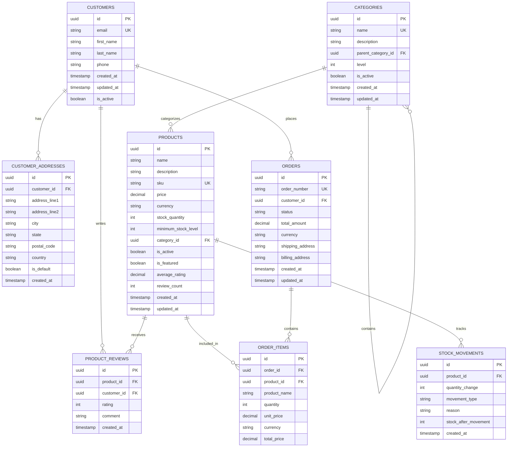

# 🗄️ Database Schema Documentation

## Overview

This document provides a comprehensive overview of the E-Commerce API database schema, including table structures, relationships, indexes, and constraints.

## 📊 Entity Relationship Diagram



## 📋 Table Definitions

### 👥 Customers Table

Stores customer information and authentication data.

```sql
CREATE TABLE customers (
    id UUID PRIMARY KEY DEFAULT gen_random_uuid(),
    email VARCHAR(255) NOT NULL UNIQUE,
    first_name VARCHAR(100) NOT NULL,
    last_name VARCHAR(100) NOT NULL,
    phone VARCHAR(20),
    created_at TIMESTAMP WITH TIME ZONE DEFAULT CURRENT_TIMESTAMP,
    updated_at TIMESTAMP WITH TIME ZONE DEFAULT CURRENT_TIMESTAMP,
    is_active BOOLEAN DEFAULT true
);

-- Indexes
CREATE INDEX idx_customers_email ON customers(email);
CREATE INDEX idx_customers_active ON customers(is_active);
CREATE INDEX idx_customers_created_at ON customers(created_at);
```

**Columns:**
- `id`: Unique identifier (UUID)
- `email`: Customer email address (unique)
- `first_name`: Customer's first name
- `last_name`: Customer's last name
- `phone`: Customer's phone number
- `created_at`: Account creation timestamp
- `updated_at`: Last update timestamp
- `is_active`: Account status flag

### 🏠 Customer Addresses Table

Stores multiple addresses for each customer.

```sql
CREATE TABLE customer_addresses (
    id UUID PRIMARY KEY DEFAULT gen_random_uuid(),
    customer_id UUID NOT NULL REFERENCES customers(id) ON DELETE CASCADE,
    address_line1 VARCHAR(255) NOT NULL,
    address_line2 VARCHAR(255),
    city VARCHAR(100) NOT NULL,
    state VARCHAR(100),
    postal_code VARCHAR(20),
    country VARCHAR(100) NOT NULL,
    is_default BOOLEAN DEFAULT false,
    created_at TIMESTAMP WITH TIME ZONE DEFAULT CURRENT_TIMESTAMP
);

-- Indexes
CREATE INDEX idx_customer_addresses_customer_id ON customer_addresses(customer_id);
CREATE INDEX idx_customer_addresses_default ON customer_addresses(customer_id, is_default);
```

**Columns:**
- `id`: Unique identifier (UUID)
- `customer_id`: Reference to customer
- `address_line1`: Primary address line
- `address_line2`: Secondary address line (optional)
- `city`: City name
- `state`: State/province
- `postal_code`: ZIP/postal code
- `country`: Country name
- `is_default`: Default address flag
- `created_at`: Creation timestamp

### 📂 Categories Table

Hierarchical product categories with self-referencing structure.

```sql
CREATE TABLE categories (
    id UUID PRIMARY KEY DEFAULT gen_random_uuid(),
    name VARCHAR(255) NOT NULL UNIQUE,
    description TEXT,
    parent_category_id UUID REFERENCES categories(id) ON DELETE SET NULL,
    level INTEGER NOT NULL DEFAULT 0,
    is_active BOOLEAN DEFAULT true,
    created_at TIMESTAMP WITH TIME ZONE DEFAULT CURRENT_TIMESTAMP,
    updated_at TIMESTAMP WITH TIME ZONE DEFAULT CURRENT_TIMESTAMP
);

-- Indexes
CREATE INDEX idx_categories_parent ON categories(parent_category_id);
CREATE INDEX idx_categories_level ON categories(level);
CREATE INDEX idx_categories_active ON categories(is_active);
CREATE INDEX idx_categories_name ON categories(name);
```

**Columns:**
- `id`: Unique identifier (UUID)
- `name`: Category name (unique)
- `description`: Category description
- `parent_category_id`: Parent category reference (self-referencing)
- `level`: Hierarchy level (0 = root)
- `is_active`: Category status flag
- `created_at`: Creation timestamp
- `updated_at`: Last update timestamp

### 🛍️ Products Table

Core product information with inventory tracking.

```sql
CREATE TABLE products (
    id UUID PRIMARY KEY DEFAULT gen_random_uuid(),
    name VARCHAR(255) NOT NULL,
    description TEXT,
    sku VARCHAR(100) NOT NULL UNIQUE,
    price DECIMAL(10,2) NOT NULL,
    currency VARCHAR(3) NOT NULL DEFAULT 'USD',
    stock_quantity INTEGER NOT NULL DEFAULT 0,
    minimum_stock_level INTEGER NOT NULL DEFAULT 0,
    category_id UUID NOT NULL REFERENCES categories(id),
    is_active BOOLEAN DEFAULT true,
    is_featured BOOLEAN DEFAULT false,
    average_rating DECIMAL(3,2) DEFAULT 0.00,
    review_count INTEGER DEFAULT 0,
    created_at TIMESTAMP WITH TIME ZONE DEFAULT CURRENT_TIMESTAMP,
    updated_at TIMESTAMP WITH TIME ZONE DEFAULT CURRENT_TIMESTAMP,
    
    CONSTRAINT chk_price_positive CHECK (price > 0),
    CONSTRAINT chk_stock_non_negative CHECK (stock_quantity >= 0),
    CONSTRAINT chk_rating_range CHECK (average_rating >= 0 AND average_rating <= 5)
);

-- Indexes
CREATE INDEX idx_products_category ON products(category_id);
CREATE INDEX idx_products_sku ON products(sku);
CREATE INDEX idx_products_active ON products(is_active);
CREATE INDEX idx_products_featured ON products(is_featured);
CREATE INDEX idx_products_stock ON products(stock_quantity);
CREATE INDEX idx_products_price ON products(price);
CREATE INDEX idx_products_rating ON products(average_rating);
CREATE INDEX idx_products_created_at ON products(created_at);

-- Full-text search index
CREATE INDEX idx_products_search ON products USING gin(to_tsvector('english', name || ' ' || COALESCE(description, '')));
```

**Columns:**
- `id`: Unique identifier (UUID)
- `name`: Product name
- `description`: Product description
- `sku`: Stock Keeping Unit (unique)
- `price`: Product price
- `currency`: Price currency code
- `stock_quantity`: Current stock level
- `minimum_stock_level`: Reorder threshold
- `category_id`: Category reference
- `is_active`: Product status flag
- `is_featured`: Featured product flag
- `average_rating`: Calculated average rating
- `review_count`: Total number of reviews
- `created_at`: Creation timestamp
- `updated_at`: Last update timestamp

### ⭐ Product Reviews Table

Customer reviews and ratings for products.

```sql
CREATE TABLE product_reviews (
    id UUID PRIMARY KEY DEFAULT gen_random_uuid(),
    product_id UUID NOT NULL REFERENCES products(id) ON DELETE CASCADE,
    customer_id UUID NOT NULL REFERENCES customers(id) ON DELETE CASCADE,
    rating INTEGER NOT NULL,
    comment TEXT,
    created_at TIMESTAMP WITH TIME ZONE DEFAULT CURRENT_TIMESTAMP,
    
    CONSTRAINT chk_rating_range CHECK (rating >= 1 AND rating <= 5),
    CONSTRAINT uk_product_customer_review UNIQUE (product_id, customer_id)
);

-- Indexes
CREATE INDEX idx_product_reviews_product ON product_reviews(product_id);
CREATE INDEX idx_product_reviews_customer ON product_reviews(customer_id);
CREATE INDEX idx_product_reviews_rating ON product_reviews(rating);
CREATE INDEX idx_product_reviews_created_at ON product_reviews(created_at);
```

**Columns:**
- `id`: Unique identifier (UUID)
- `product_id`: Product reference
- `customer_id`: Customer reference
- `rating`: Rating (1-5 stars)
- `comment`: Review comment (optional)
- `created_at`: Review timestamp

### 📦 Orders Table

Customer orders with status tracking.

```sql
CREATE TABLE orders (
    id UUID PRIMARY KEY DEFAULT gen_random_uuid(),
    order_number VARCHAR(50) NOT NULL UNIQUE,
    customer_id UUID NOT NULL REFERENCES customers(id),
    status VARCHAR(50) NOT NULL DEFAULT 'Pending',
    total_amount DECIMAL(10,2) NOT NULL,
    currency VARCHAR(3) NOT NULL DEFAULT 'USD',
    shipping_address TEXT NOT NULL,
    billing_address TEXT NOT NULL,
    created_at TIMESTAMP WITH TIME ZONE DEFAULT CURRENT_TIMESTAMP,
    updated_at TIMESTAMP WITH TIME ZONE DEFAULT CURRENT_TIMESTAMP,
    
    CONSTRAINT chk_total_positive CHECK (total_amount > 0)
);

-- Indexes
CREATE INDEX idx_orders_customer ON orders(customer_id);
CREATE INDEX idx_orders_status ON orders(status);
CREATE INDEX idx_orders_order_number ON orders(order_number);
CREATE INDEX idx_orders_created_at ON orders(created_at);
CREATE INDEX idx_orders_total_amount ON orders(total_amount);
```

**Columns:**
- `id`: Unique identifier (UUID)
- `order_number`: Human-readable order number
- `customer_id`: Customer reference
- `status`: Order status (Pending, Processing, Shipped, Delivered, Cancelled)
- `total_amount`: Order total amount
- `currency`: Currency code
- `shipping_address`: Shipping address
- `billing_address`: Billing address
- `created_at`: Order creation timestamp
- `updated_at`: Last update timestamp

### 📋 Order Items Table

Individual items within an order.

```sql
CREATE TABLE order_items (
    id UUID PRIMARY KEY DEFAULT gen_random_uuid(),
    order_id UUID NOT NULL REFERENCES orders(id) ON DELETE CASCADE,
    product_id UUID NOT NULL REFERENCES products(id),
    product_name VARCHAR(255) NOT NULL,
    quantity INTEGER NOT NULL,
    unit_price DECIMAL(10,2) NOT NULL,
    currency VARCHAR(3) NOT NULL DEFAULT 'USD',
    total_price DECIMAL(10,2) NOT NULL,
    
    CONSTRAINT chk_quantity_positive CHECK (quantity > 0),
    CONSTRAINT chk_unit_price_positive CHECK (unit_price > 0),
    CONSTRAINT chk_total_price_positive CHECK (total_price > 0)
);

-- Indexes
CREATE INDEX idx_order_items_order ON order_items(order_id);
CREATE INDEX idx_order_items_product ON order_items(product_id);
```

**Columns:**
- `id`: Unique identifier (UUID)
- `order_id`: Order reference
- `product_id`: Product reference
- `product_name`: Product name snapshot
- `quantity`: Quantity ordered
- `unit_price`: Price per unit at time of order
- `currency`: Currency code
- `total_price`: Total price for this line item

### 📊 Stock Movements Table

Audit trail for all stock changes.

```sql
CREATE TABLE stock_movements (
    id UUID PRIMARY KEY DEFAULT gen_random_uuid(),
    product_id UUID NOT NULL REFERENCES products(id) ON DELETE CASCADE,
    quantity_change INTEGER NOT NULL,
    movement_type VARCHAR(50) NOT NULL,
    reason VARCHAR(255),
    stock_after_movement INTEGER NOT NULL,
    created_at TIMESTAMP WITH TIME ZONE DEFAULT CURRENT_TIMESTAMP,
    
    CONSTRAINT chk_stock_after_non_negative CHECK (stock_after_movement >= 0)
);

-- Indexes
CREATE INDEX idx_stock_movements_product ON stock_movements(product_id);
CREATE INDEX idx_stock_movements_type ON stock_movements(movement_type);
CREATE INDEX idx_stock_movements_created_at ON stock_movements(created_at);
```

**Columns:**
- `id`: Unique identifier (UUID)
- `product_id`: Product reference
- `quantity_change`: Change in quantity (positive or negative)
- `movement_type`: Type of movement (Sale, Purchase, Adjustment, Return)
- `reason`: Reason for the movement
- `stock_after_movement`: Stock level after this movement
- `created_at`: Movement timestamp

## 🔧 Database Functions and Triggers

### Update Product Rating Function

```sql
CREATE OR REPLACE FUNCTION update_product_rating()
RETURNS TRIGGER AS $$
BEGIN
    UPDATE products 
    SET 
        average_rating = (
            SELECT COALESCE(AVG(rating::DECIMAL), 0) 
            FROM product_reviews 
            WHERE product_id = COALESCE(NEW.product_id, OLD.product_id)
        ),
        review_count = (
            SELECT COUNT(*) 
            FROM product_reviews 
            WHERE product_id = COALESCE(NEW.product_id, OLD.product_id)
        ),
        updated_at = CURRENT_TIMESTAMP
    WHERE id = COALESCE(NEW.product_id, OLD.product_id);
    
    RETURN COALESCE(NEW, OLD);
END;
$$ LANGUAGE plpgsql;

-- Triggers
CREATE TRIGGER trg_update_product_rating_insert
    AFTER INSERT ON product_reviews
    FOR EACH ROW EXECUTE FUNCTION update_product_rating();

CREATE TRIGGER trg_update_product_rating_update
    AFTER UPDATE ON product_reviews
    FOR EACH ROW EXECUTE FUNCTION update_product_rating();

CREATE TRIGGER trg_update_product_rating_delete
    AFTER DELETE ON product_reviews
    FOR EACH ROW EXECUTE FUNCTION update_product_rating();
```

### Generate Order Number Function

```sql
CREATE OR REPLACE FUNCTION generate_order_number()
RETURNS TRIGGER AS $$
BEGIN
    NEW.order_number := 'ORD-' || TO_CHAR(CURRENT_DATE, 'YYYYMMDD') || '-' || 
                       LPAD(NEXTVAL('order_number_seq')::TEXT, 6, '0');
    RETURN NEW;
END;
$$ LANGUAGE plpgsql;

-- Sequence for order numbers
CREATE SEQUENCE IF NOT EXISTS order_number_seq START 1;

-- Trigger
CREATE TRIGGER trg_generate_order_number
    BEFORE INSERT ON orders
    FOR EACH ROW EXECUTE FUNCTION generate_order_number();
```

### Update Timestamps Function

```sql
CREATE OR REPLACE FUNCTION update_updated_at()
RETURNS TRIGGER AS $$
BEGIN
    NEW.updated_at = CURRENT_TIMESTAMP;
    RETURN NEW;
END;
$$ LANGUAGE plpgsql;

-- Apply to tables with updated_at column
CREATE TRIGGER trg_customers_updated_at
    BEFORE UPDATE ON customers
    FOR EACH ROW EXECUTE FUNCTION update_updated_at();

CREATE TRIGGER trg_categories_updated_at
    BEFORE UPDATE ON categories
    FOR EACH ROW EXECUTE FUNCTION update_updated_at();

CREATE TRIGGER trg_products_updated_at
    BEFORE UPDATE ON products
    FOR EACH ROW EXECUTE FUNCTION update_updated_at();

CREATE TRIGGER trg_orders_updated_at
    BEFORE UPDATE ON orders
    FOR EACH ROW EXECUTE FUNCTION update_updated_at();
```

## 📈 Performance Optimization

### Partitioning Strategy

```sql
-- Partition orders by month for better performance
CREATE TABLE orders_partitioned (
    LIKE orders INCLUDING ALL
) PARTITION BY RANGE (created_at);

-- Create monthly partitions
CREATE TABLE orders_2024_01 PARTITION OF orders_partitioned
    FOR VALUES FROM ('2024-01-01') TO ('2024-02-01');

CREATE TABLE orders_2024_02 PARTITION OF orders_partitioned
    FOR VALUES FROM ('2024-02-01') TO ('2024-03-01');
-- ... continue for other months
```

### Materialized Views

```sql
-- Product statistics materialized view
CREATE MATERIALIZED VIEW product_stats AS
SELECT 
    p.id,
    p.name,
    p.category_id,
    c.name as category_name,
    p.price,
    p.stock_quantity,
    p.average_rating,
    p.review_count,
    COUNT(oi.id) as total_orders,
    SUM(oi.quantity) as total_sold,
    SUM(oi.total_price) as total_revenue
FROM products p
LEFT JOIN categories c ON p.category_id = c.id
LEFT JOIN order_items oi ON p.id = oi.product_id
LEFT JOIN orders o ON oi.order_id = o.id
WHERE p.is_active = true
GROUP BY p.id, p.name, p.category_id, c.name, p.price, p.stock_quantity, p.average_rating, p.review_count;

-- Refresh materialized view periodically
CREATE INDEX idx_product_stats_category ON product_stats(category_id);
CREATE INDEX idx_product_stats_revenue ON product_stats(total_revenue DESC);
```

## 🔒 Security Considerations

### Row Level Security (RLS)

```sql
-- Enable RLS on sensitive tables
ALTER TABLE customers ENABLE ROW LEVEL SECURITY;
ALTER TABLE orders ENABLE ROW LEVEL SECURITY;
ALTER TABLE customer_addresses ENABLE ROW LEVEL SECURITY;

-- Policies for customer data access
CREATE POLICY customer_own_data ON customers
    FOR ALL TO application_user
    USING (id = current_setting('app.current_customer_id')::UUID);

CREATE POLICY customer_own_orders ON orders
    FOR ALL TO application_user
    USING (customer_id = current_setting('app.current_customer_id')::UUID);
```

### Data Encryption

```sql
-- Encrypt sensitive data
CREATE EXTENSION IF NOT EXISTS pgcrypto;

-- Example: Encrypt customer phone numbers
ALTER TABLE customers 
ADD COLUMN phone_encrypted BYTEA;

-- Function to encrypt phone numbers
CREATE OR REPLACE FUNCTION encrypt_phone()
RETURNS TRIGGER AS $$
BEGIN
    IF NEW.phone IS NOT NULL THEN
        NEW.phone_encrypted = pgp_sym_encrypt(NEW.phone, current_setting('app.encryption_key'));
    END IF;
    RETURN NEW;
END;
$$ LANGUAGE plpgsql;
```

## 📊 Monitoring and Maintenance

### Database Statistics

```sql
-- Query to monitor table sizes
SELECT 
    schemaname,
    tablename,
    pg_size_pretty(pg_total_relation_size(schemaname||'.'||tablename)) as size,
    pg_total_relation_size(schemaname||'.'||tablename) as size_bytes
FROM pg_tables 
WHERE schemaname = 'public'
ORDER BY size_bytes DESC;

-- Index usage statistics
SELECT 
    schemaname,
    tablename,
    indexname,
    idx_scan,
    idx_tup_read,
    idx_tup_fetch
FROM pg_stat_user_indexes
ORDER BY idx_scan DESC;
```

### Maintenance Scripts

```sql
-- Vacuum and analyze tables
VACUUM ANALYZE customers;
VACUUM ANALYZE products;
VACUUM ANALYZE orders;
VACUUM ANALYZE order_items;

-- Reindex for performance
REINDEX TABLE products;
REINDEX TABLE orders;

-- Update table statistics
ANALYZE customers;
ANALYZE products;
ANALYZE orders;
```

This database schema provides a solid foundation for an e-commerce application with proper normalization, indexing, and performance considerations.