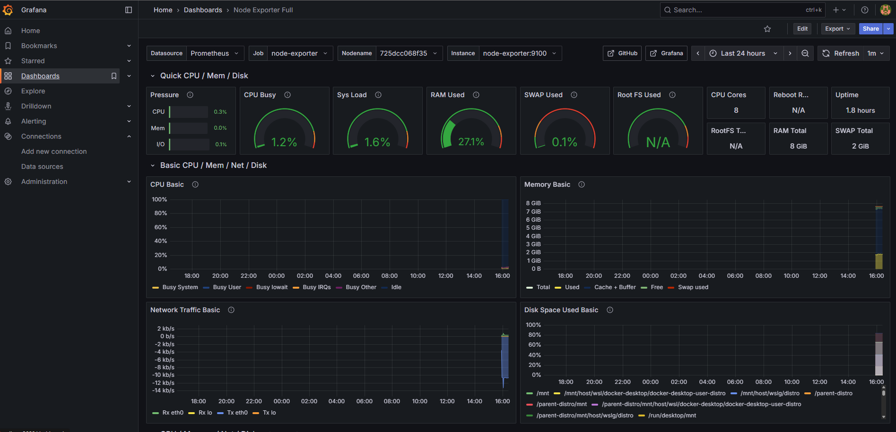
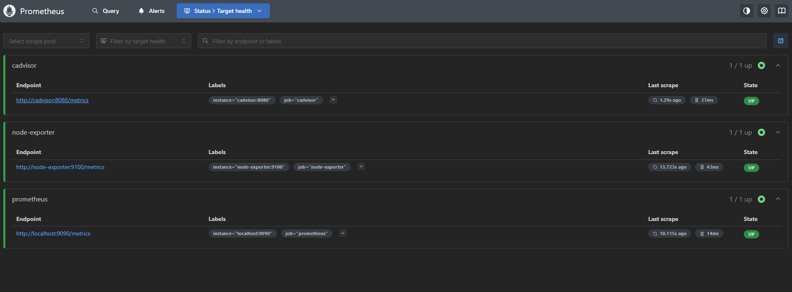
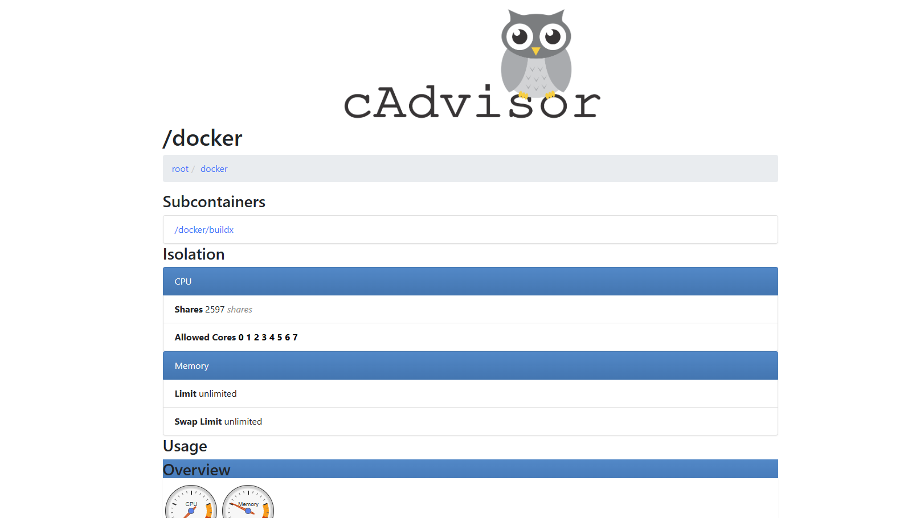

# 📊 Monitoring & Observability Guide

## 🎯 **Live Monitoring Showcase**

<div align="center">

### 📊 **Real-time System Monitoring**

*Enterprise-grade monitoring dashboard with real-time metrics*

### 🎯 **Infrastructure Health**

*All monitoring targets healthy and collecting metrics*

### 🐳 **Container Performance**

*Detailed container resource monitoring and analytics*

</div>

## Overview

This document provides comprehensive information about the monitoring and observability stack for the E-Commerce API, including setup, configuration, and usage guidelines.

## 🏗️ Monitoring Architecture


## 🚀 Quick Start

### Prerequisites

- Docker and Docker Compose installed
- At least 4GB RAM available for monitoring stack
- Ports 3000, 9090, 9093, 3100, 8081, 9100 available

### Option 1: Full Stack with Monitoring

Start the complete application with monitoring:

```bash
# Linux/macOS
./scripts/monitoring-setup.sh

# Windows PowerShell
.\scripts\monitoring-setup.ps1
```

### Option 2: Monitoring Only

Start only the monitoring stack:

```bash
# Linux/macOS
./scripts/monitoring-setup.sh --monitoring-only

# Windows PowerShell
.\scripts\monitoring-setup.ps1 -MonitoringOnly
```

### Option 3: Manual Setup

```bash
# Start all services
docker-compose up -d

# Or start only monitoring services
docker-compose -f docker-compose.monitoring.yml up -d
```

## 📊 Monitoring Components

### 1. Prometheus (Metrics Collection)

**Purpose**: Time-series database for metrics collection
**Port**: 9090
**URL**: http://localhost:9090

**Key Features**:
- Scrapes metrics from all exporters
- Stores time-series data
- Provides PromQL query language
- Triggers alerts based on rules

**Configuration**: `config/prometheus.yml`

### 2. Grafana (Visualization)

**Purpose**: Metrics visualization and dashboards
**Port**: 3000
**URL**: http://localhost:3000
**Credentials**: admin/admin

**Key Features**:
- Pre-configured dashboards
- Real-time metrics visualization
- Alert management
- Multi-datasource support

**Dashboards**:
- E-Commerce API Overview
- Infrastructure Monitoring
- Database Performance
- Application Performance

### 3. AlertManager (Alert Handling)

**Purpose**: Alert routing and notification
**Port**: 9093
**URL**: http://localhost:9093

**Key Features**:
- Alert deduplication
- Grouping and routing
- Multiple notification channels
- Silence management

**Configuration**: `config/alertmanager.yml`

### 4. Loki (Log Aggregation)

**Purpose**: Log aggregation and querying
**Port**: 3100
**URL**: http://localhost:3100

**Key Features**:
- Structured log storage
- LogQL query language
- Integration with Grafana
- Label-based indexing

**Configuration**: `config/loki.yml`

### 5. Promtail (Log Collection)

**Purpose**: Log collection agent
**Configuration**: `config/promtail.yml`

**Key Features**:
- Docker container log collection
- Application log parsing
- Label extraction
- Real-time streaming

## 📈 Metrics and KPIs

### Application Metrics

| Metric | Description | Type | Labels |
|--------|-------------|------|--------|
| `http_requests_total` | Total HTTP requests | Counter | method, status, endpoint |
| `http_request_duration_seconds` | Request duration | Histogram | method, endpoint |
| `database_connections_active` | Active DB connections | Gauge | database |
| `cache_hits_total` | Cache hits | Counter | cache_type |
| `cache_misses_total` | Cache misses | Counter | cache_type |
| `orders_created_total` | Orders created | Counter | status |
| `products_searched_total` | Product searches | Counter | - |

### Infrastructure Metrics

| Metric | Description | Source |
|--------|-------------|--------|
| `container_cpu_usage_seconds_total` | Container CPU usage | cAdvisor |
| `container_memory_usage_bytes` | Container memory usage | cAdvisor |
| `node_cpu_seconds_total` | Node CPU usage | Node Exporter |
| `node_memory_MemAvailable_bytes` | Available memory | Node Exporter |
| `node_filesystem_avail_bytes` | Available disk space | Node Exporter |

### Database Metrics

| Metric | Description | Source |
|--------|-------------|--------|
| `pg_stat_database_numbackends` | Active connections | PostgreSQL Exporter |
| `pg_stat_database_tup_fetched` | Rows fetched | PostgreSQL Exporter |
| `pg_stat_database_tup_inserted` | Rows inserted | PostgreSQL Exporter |
| `redis_connected_clients` | Connected clients | Redis Exporter |
| `redis_memory_used_bytes` | Memory usage | Redis Exporter |

## 🚨 Alerting Rules

### Critical Alerts

- **Application Down**: API not responding for > 1 minute
- **Database Down**: PostgreSQL not accessible
- **High Error Rate**: Error rate > 5% for > 2 minutes
- **Container Down**: Any container stopped

### Warning Alerts

- **High CPU Usage**: Container CPU > 80% for > 5 minutes
- **High Memory Usage**: Container memory > 80% for > 5 minutes
- **High Response Time**: 95th percentile > 1 second for > 5 minutes
- **Low Disk Space**: Available disk < 20%

### Alert Configuration

Alerts are defined in `config/alert_rules.yml`:

```yaml
- alert: HighErrorRate
  expr: rate(http_requests_total{status=~"5.."}[5m]) > 0.05
  for: 2m
  labels:
    severity: warning
  annotations:
    summary: "High error rate detected"
    description: "Error rate is {{ $value }} errors per second"
```

## 📊 Dashboard Guide

### E-Commerce API Overview Dashboard

**Panels**:
1. **Request Rate**: Real-time API request rate
2. **Response Time**: 95th percentile response time
3. **Error Rate**: Percentage of failed requests
4. **Active Connections**: Database connection count
5. **HTTP Requests by Status**: Request breakdown by status code
6. **Container Resources**: CPU and memory usage
7. **Database Performance**: Query performance metrics

### Infrastructure Dashboard

**Panels**:
1. **System Overview**: CPU, memory, disk usage
2. **Container Metrics**: Per-container resource usage
3. **Network Traffic**: Network I/O statistics
4. **Disk I/O**: Disk read/write operations

### Database Dashboard

**Panels**:
1. **Connection Pool**: Active/idle connections
2. **Query Performance**: Slow queries, query rate
3. **Cache Hit Ratio**: Database cache efficiency
4. **Lock Statistics**: Database locks and waits

## 🔍 Log Analysis

### Log Sources

1. **Application Logs**: Structured JSON logs from the API
2. **Container Logs**: Docker container stdout/stderr
3. **System Logs**: Operating system logs
4. **Access Logs**: HTTP access logs

### Log Queries (LogQL)

```logql
# Error logs from the API
{job="ecommerce-api"} |= "ERROR"

# Slow queries
{job="ecommerce-api"} | json | duration > 1s

# Failed orders
{job="ecommerce-api"} |= "PlaceOrderCommand" |= "failed"

# High memory usage warnings
{job="containerlogs"} |= "memory" |= "warning"
```

### Log Retention

- **Application Logs**: 30 days
- **System Logs**: 7 days
- **Access Logs**: 14 days

## 🔧 Configuration

### Prometheus Configuration

Key scrape targets in `config/prometheus.yml`:

```yaml
scrape_configs:
  - job_name: 'ecommerce-api'
    static_configs:
      - targets: ['ecommerce-api:8080']
    scrape_interval: 10s
    
  - job_name: 'postgres-exporter'
    static_configs:
      - targets: ['postgres-exporter:9187']
```

### Grafana Configuration

Datasources are automatically provisioned:
- **Prometheus**: http://prometheus:9090
- **Loki**: http://loki:3100

### Alert Configuration

Notification channels in `config/alertmanager.yml`:

```yaml
receivers:
  - name: 'critical-alerts'
    email_configs:
      - to: 'admin@ecommerce-api.com'
        subject: '🚨 CRITICAL: {{ .GroupLabels.alertname }}'
    slack_configs:
      - api_url: 'YOUR_SLACK_WEBHOOK_URL'
        channel: '#critical-alerts'
```

## 🚀 Performance Optimization

### Monitoring Performance Tips

1. **Reduce Scrape Intervals**: Adjust based on needs
2. **Optimize Queries**: Use efficient PromQL queries
3. **Limit Retention**: Configure appropriate retention periods
4. **Use Recording Rules**: Pre-calculate expensive queries

### Resource Requirements

| Component | CPU | Memory | Disk |
|-----------|-----|--------|------|
| Prometheus | 0.5 cores | 2GB | 10GB |
| Grafana | 0.2 cores | 512MB | 1GB |
| Loki | 0.3 cores | 1GB | 5GB |
| AlertManager | 0.1 cores | 256MB | 1GB |
| Exporters | 0.1 cores | 128MB | - |

## 🔒 Security Considerations

### Authentication

- **Grafana**: Admin user with strong password
- **Prometheus**: Internal network access only
- **AlertManager**: Webhook authentication

### Network Security

- All monitoring traffic on internal Docker network
- External access only through defined ports
- TLS encryption for external communications

### Data Privacy

- No sensitive data in metrics labels
- Log sanitization for PII
- Secure storage of credentials

## 🛠️ Troubleshooting

### Common Issues

#### Prometheus Not Scraping Targets

```bash
# Check target status
curl http://localhost:9090/api/v1/targets

# Check Prometheus logs
docker logs ecommerce-prometheus
```

#### Grafana Dashboard Not Loading

```bash
# Check Grafana logs
docker logs ecommerce-grafana

# Verify datasource connectivity
curl http://localhost:3000/api/datasources/proxy/1/api/v1/query?query=up
```

#### High Memory Usage

```bash
# Check container resource usage
docker stats

# Adjust retention periods in prometheus.yml
--storage.tsdb.retention.time=7d
```

### Log Analysis Commands

```bash
# View application logs
docker logs ecommerce-api --tail 100 -f

# Search for errors
docker logs ecommerce-api 2>&1 | grep ERROR

# Check container health
docker ps --format "table {{.Names}}\t{{.Status}}\t{{.Ports}}"
```

## 📚 Additional Resources

### Prometheus Resources

- [PromQL Tutorial](https://prometheus.io/docs/prometheus/latest/querying/basics/)
- [Recording Rules](https://prometheus.io/docs/prometheus/latest/configuration/recording_rules/)
- [Alerting Rules](https://prometheus.io/docs/prometheus/latest/configuration/alerting_rules/)

### Grafana Resources

- [Dashboard Best Practices](https://grafana.com/docs/grafana/latest/best-practices/)
- [Panel Types](https://grafana.com/docs/grafana/latest/panels/)
- [Templating](https://grafana.com/docs/grafana/latest/variables/)

### Loki Resources

- [LogQL Tutorial](https://grafana.com/docs/loki/latest/logql/)
- [Log Parsing](https://grafana.com/docs/loki/latest/logql/log_queries/)
- [Label Best Practices](https://grafana.com/docs/loki/latest/best-practices/)

## 🔄 Maintenance

### Regular Tasks

1. **Weekly**: Review alert thresholds
2. **Monthly**: Clean up old dashboards
3. **Quarterly**: Review retention policies
4. **Annually**: Update monitoring stack versions

### Backup Strategy

```bash
# Backup Grafana dashboards
curl -H "Authorization: Bearer YOUR_API_KEY" \
  http://localhost:3000/api/search?type=dash-db | \
  jq -r '.[] | .uri' | \
  xargs -I {} curl -H "Authorization: Bearer YOUR_API_KEY" \
  http://localhost:3000/api/dashboards/{} > dashboards_backup.json

# Backup Prometheus data
docker run --rm -v prometheus_data:/data -v $(pwd):/backup \
  alpine tar czf /backup/prometheus_backup.tar.gz /data
```

This monitoring setup provides comprehensive observability for your E-Commerce API, enabling proactive issue detection and performance optimization.